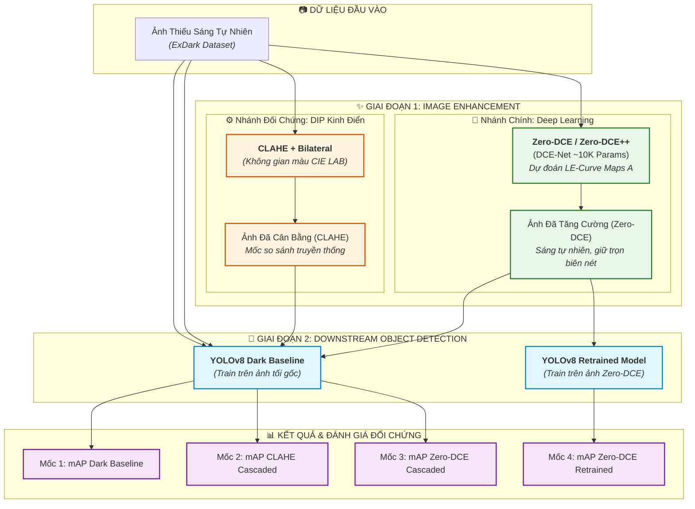

# Project 18: Low-Light Image Enhancement and Downstream Recognition

[](https://www.python.org/)
[](https://pytorch.org/)
[](https://github.com/Li-Chongyi/Zero-DCE)
[](https://github.com/ultralytics/ultralytics)
[](https://github.com/cs-chan/ExDark-Dataset)

> **Khóa học / Đồ án:** Đồ án Môn học / Final Project Xử lý ảnh & Thị giác Máy tính (Computer Vision)  
> **Thời lượng thực hiện:** 2.5 tuần (~18 ngày)  
> **Quy mô nhóm:** 5 – 6 thành viên (Mỗi thành viên: 2 giờ/ngày)  
> **Môi trường thực nghiệm:** Python 3.9+, PyTorch, Ultralytics, OpenCV, Google Colab / Kaggle T4 GPU (Miễn phí)

---

## Mục lục (Table of Contents)
1. [Tổng quan Đề tài & Bối cảnh Nghiên cứu](#1-tổng-quan-đề-tài--bối-cảnh-nghiên-cứu)
2. [Phân loại Bài toán trong Computer Vision](#2-phân-loại-bài-toán-trong-computer-vision)
3. [Kiến trúc Mô hình GĐ1: Deep Learning Zero-DCE / Zero-DCE++](#3-kiến-trúc-mô-hình-gđ1-deep-learning-zero-dce--zero-dce)
4. [Kiến trúc Mô hình GĐ2: Object Detection với YOLOv8](#4-kiến-trúc-mô-hình-gđ2-object-detection-với-yolov8)
5. [Chiến Lược Khớp Nối GĐ1 và GĐ2 (Co-Design & Alignment Strategy)](#5-chiến-lược-khớp-nối-gđ1-và-gđ2-co-design--alignment-strategy)
6. [Sơ đồ Pipeline Tổng Thể (End-to-End System)](#6-sơ-đồ-pipeline-tổng-thể-end-to-end-system)
7. [Bộ Dữ Liệu (Dataset) ExDark & Format Chuẩn Hóa](#7-bộ-dữ-liệu-dataset-exdark--format-chuẩn-hóa)
8. [Kế Hoạch Triển Khai Thực Nghiệm Chi Tiết (Sprint 18 Ngày)](#8-kế-hoạch-triển-khai-thực-nghiệm-chi-tiết-sprint-18-ngày)
9. [Các Tiêu Chí Đánh Giá (Evaluation Metrics)](#9-các-tiêu-chí-đánh-giá-evaluation-metrics)
10. [Bảng Kết Quả Thực Nghiệm Dự Kiến & Phân Tích Khoa Học](#10-bảng-kết-quả-thực-nghiệm-dự-kiến--phân-tích-khoa-học)
11. [Cấu Trúc Thư Mục Dự Án & Kịch Bản run.py Tự Động](#11-cấu-trúc-thư-mục-dự-án--kịch-bản-runpy-tự-động)
12. [Mục Tiêu Đầu Ra Đạt Được (Learning Outcomes)](#12-mục-tiêu-đầu-ra-đạt-được-learning-outcomes)

---

## 1. Tổng quan Đề tài & Bối cảnh Nghiên cứu

### 1.1. Bối cảnh & Thách thức Kỹ thuật
Hình ảnh thu nhận trong điều kiện môi trường ban đêm hoặc thiếu sáng nghiêm trọng (**Low-Light Conditions**) luôn gặp các suy thoái quang học phức tạp:
* **Độ tương phản cực thấp:** Phổ mức xám bị dồn nghẽn ở vùng tối ($[0, 50]$), làm chìm hoàn toàn thông tin chi tiết và biên dạng vật thể.
* **Tỷ lệ tín hiệu trên nhiễu thấp (Low SNR):** Nhiễu hạt cảm biến (sensor noise, chrominance noise) dày đặc do camera tự động đẩy độ nhạy ISO lên cao.
* **Mất kết cấu vi mô (Texture Degradation):** Biên cạnh bị mờ nhòe khiến các thuật toán trích xuất đặc trưng truyền thống lẫn các mạng nơ-ron nhận diện hiện đại bị giảm độ chính xác nghiêm trọng.

Hệ quả là các mô hình AI thị giác tiêu chuẩn (vốn được huấn luyện chủ yếu trên tập dữ liệu đủ sáng như COCO, ImageNet) bị **suy giảm độ chính xác nghiêm trọng** khi áp dụng vào thực tiễn: **Camera giám sát an ninh ban đêm, hệ thống lái xe tự hành (ADAS/Autonomous Vehicles), robot cứu nạn cứu hộ ban đêm**.

### 1.2. Mục tiêu nghiên cứu cốt lõi
1. **Giai đoạn 1 (Low-Light Image Enhancement - LLIE via Deep Learning):**
   * Triển khai mô hình học sâu **Zero-DCE (Zero-Reference Deep Curve Estimation)** và phiên bản cải tiến siêu nhẹ **Zero-DCE++** để ước lượng các đường cong ánh sáng bậc cao lặp (Higher-Order Light-Enhancement Curves) trên từng pixel.
   * Huấn luyện theo cơ chế **Zero-Reference (Tự giám sát / Không cần cặp ảnh sáng chuẩn GT)**, cực kỳ phù hợp với dữ liệu ảnh tối chụp thực tế.
   * Song song, triển khai kỹ thuật xử lý ảnh kinh điển (**DIP Baseline: CLAHE + Bilateral Filter**) để làm mốc đối chứng giữa phương pháp truyền thống và Deep Learning.
2. **Giai đoạn 2 (Downstream Recognition Task):**
   * Đánh giá hiệu năng nhận diện và định vị vật thể (**Object Detection**) bằng kiến trúc **YOLOv8** (`yolov8n` / `yolov8s`) trên tập dữ liệu chuẩn **ExDark (Exclusively Dark)**.
3. **Câu hỏi nghiên cứu khoa học cốt lõi (Core Scientific Hypothesis):**
   > *"Liệu việc tăng cường chất lượng cảm quan cho mắt người bằng mô hình học sâu không tham chiếu (Zero-DCE) hoặc kỹ thuật xử lý ảnh kinh điển (CLAHE) có thực sự giúp mô hình Object Detection (YOLOv8) nhận diện chính xác hơn hay không? Hay việc làm sáng bằng mạng nơ-ron có thể sinh ra nhiễu giả (artifacts/hallucinations) làm giảm mAP của detector?"*

---

## 2. Phân loại Bài toán trong Computer Vision

Đề tài thuộc dạng **Two-Stage Cascaded Vision Pipeline (Chuỗi thị giác kết hợp 2 giai đoạn: Cấp thấp $\rightarrow$ Cấp cao)**:

```
[Ảnh Đầu Vào: Thiếu Sáng Tự Nhiên]
                 │
                 ▼
┌─────────────────────────────────────────────────────────────┐
│ GIAI ĐOẠN 1: Low-Level Vision (Xử lý ảnh mức thấp)          │
│ Bài toán: Low-Light Image Enhancement (LLIE)                │
│ Mô hình chính: Zero-DCE / Zero-DCE++ (Deep Learning)       │
│ Mốc đối chứng: CLAHE + Bilateral Filter (DIP Truyền Thống)   │
│ Cơ chế: Zero-Reference (Tự học đường cong ánh sáng LE-Curve)│
└─────────────────────────────────────────────────────────────┘
                 │ (Ảnh đã được tăng cường sáng & phục hồi biên)
                 ▼
┌─────────────────────────────────────────────────────────────┐
│ GIAI ĐOẠN 2: High-Level Vision (Thị giác mức cao)          │
│ Bài toán: Object Detection (Nhận diện & Định vị vật thể)    │
│ Mô hình: Ultralytics YOLOv8 (Anchor-Free, C2f Backbone)     │
│ Mục tiêu: Tối ưu mAP@0.5, mAP@0.5:0.95 trên 12 classes       │
└─────────────────────────────────────────────────────────────┘
                 │
                 ▼
[Ảnh Đầu Ra: Bounding Boxes + Class Labels + Confidence Scores]
```

### 2.1. Nguồn Dữ Liệu Thực Nghiệm (Dataset Access Links)
Để phục vụ xuyên suốt cho cả **Giai đoạn 1 (tăng cường ảnh không giám sát)** và **Giai đoạn 2 (huấn luyện & đánh giá YOLOv8)**, đề tài sử dụng bộ dữ liệu chuẩn quốc tế **ExDark (Exclusively Dark)**. Các liên kết truy cập và tải dữ liệu chính thức:


* **Link 2 (Roboflow Universe - Chuẩn hóa nhãn & Train/Val/Test Split):**  
  👉 [ExDark trên Roboflow Universe](https://universe.roboflow.com/project-h68de/exdark-kd37x/dataset/12)  
  *(Hỗ trợ tải 1-click hoặc xuất code nạp trực tiếp vào Google Colab)*


---

## 3. Kiến trúc Mô hình GĐ1: Deep Learning Zero-DCE / Zero-DCE++

### 3.1. Tại sao lựa chọn Zero-DCE / Zero-DCE++?
Trong bài toán Low-Light Enhancement bằng Deep Learning, phần lớn các mô hình cổ điển (như RetinexNet, KinD, LLNet) đòi hỏi **bộ dữ liệu cặp đối ứng (Paired Dataset: ảnh tối đi kèm ảnh sáng chụp cùng góc)**. Tuy nhiên, trong thực tế (nhất là bộ dữ liệu ExDark), **hoàn toàn không có ảnh sáng chuẩn làm Ground Truth**.

**Zero-DCE (CVPR 2020)** và **Zero-DCE++ (TPAMI 2021)** là giải pháp đột phá giải quyết triệt để bài toán này:
* **Zero-Reference:** Không cần bất kỳ ảnh sáng chuẩn nào để huấn luyện.
* **Tránh méo màu & artifacts:** Thay vì ép mạng nơ-ron sinh trực tiếp các giá trị pixel RGB (vốn rất dễ sinh ảo ảnh/artifacts và méo màu), Zero-DCE huấn luyện một mạng CNN nhẹ (**DCE-Net**) để dự đoán **bản đồ tham số đường cong ánh sáng (Curve Parameter Maps)**.
* **Siêu nhẹ & Thời gian thực (Real-time):**
  * `Zero-DCE`: ~79K tham số.
  * `Zero-DCE++`: Tận dụng **Depthwise Separable Convolutions**, rút gọn xuống chỉ còn **~10.000 tham số (10K params)**! Tốc độ suy luận đạt hơn **100 FPS trên GPU Colab**, hoàn toàn đáp ứng thời gian thực cho camera an ninh và xe tự hành.

### 3.2. Công thức Toán học: Đường cong ánh sáng bậc cao (Light-Enhancement Curve - LE-Curve)
Đường cong làm sáng bậc 1 được thiết kế tương tự hàm điều chỉnh Gamma nhưng có khả năng tự thích nghi cục bộ theo từng pixel:
$$LE(I(x)) = I(x) + \mathcal{A}(x) \cdot I(x) \cdot (1 - I(x))$$

Trong đó:
* $x$ là tọa độ pixel, $I(x)$ là giá trị pixel đầu vào chuẩn hóa về khoảng $[0, 1]$.
* $\mathcal{A}(x) \in [-1, 1]$ là bản đồ tham số độ dốc cong do mạng **DCE-Net** dự đoán cho từng pixel.

Để tăng dải động và xử lý các vùng tối sâu, Zero-DCE lặp lại công thức trên qua $n$ bước lặp (thông thường $n = 8$ bước):
$$LE_n(x) = LE_{n-1}(x) + \mathcal{A}_n(x) \cdot LE_{n-1}(x) \cdot (1 - LE_{n-1}(x))$$

Nhờ tính chất toán học của phương trình bậc 2 này:
1. Đảm bảo giá trị đầu ra luôn nằm trọn trong đoạn $[0, 1]$ mà không bị tràn (clipping).
2. Tăng cường độ sáng mạnh mẽ cho vùng tối trong khi bảo toàn các vùng vốn đã đủ sáng.

```
            LE-Curve Transformation (Qua 8 bước lặp)
     1.0 ┌───────────────────────────────────────────/
         │                                      _--/
         │                                  _--/
Output   │                             _--/
Pixel    │                        _--/
LE_8(x)  │                   _--/
         │              _--/
         │         _--/
     0.0 └────────/──────────────────────────────────
        0.0          Input Pixel I(x)               1.0
```

### 3.3. Kiến trúc Mạng DCE-Net & Zero-DCE++
Mạng nơ-ron **DCE-Net** là một mạng tích chập đối xứng với các đường kết nối tắt (Skip Connections):
* Đầu vào: Ảnh tối 3 kênh kích thước $H \times W \times 3$.
* Gồm 7 tầng Convolution liên tiếp (mỗi tầng có 32 channels, hàm kích hoạt ReLU).
* **Skip Connections:** Kết nối tầng 1 với tầng 6, tầng 2 với tầng 5, tầng 3 với tầng 4 (tương tự U-Net thu nhỏ) giúp bảo toàn chi tiết không gian đa tỉ lệ.
* Đầu ra: Bản đồ tham số kích thước $H \times W \times 24$ (ứng với 8 bước lặp $\times$ 3 kênh màu RGB).
* **Cải tiến trong Zero-DCE++:** Thay toàn bộ Standard Convolutions bằng **Depthwise Separable Convolutions** giúp giảm dung lượng model xuống còn **1/8** mà vẫn giữ nguyên độ chính xác.

### 3.4. Hệ thống 4 Hàm Mất Mát Tự Giám Sát (Non-Reference Loss Functions)
Vì không có ảnh tham chiếu (Ground Truth), Zero-DCE được tối ưu thông qua sự kết hợp của 4 hàm loss đặc thù:

$$\mathcal{L}_{total} = \mathcal{L}_{spa} + \mathcal{L}_{exp} + W_{col} \mathcal{L}_{col} + W_{tv} \mathcal{L}_{tv\_A}$$

1. **Spatial Consistency Loss ($\mathcal{L}_{spa}$):**
   * Bảo tồn sự chênh lệch mức xám giữa các vùng lân cận (4 hướng lân cận: trên, dưới, trái, phải) giữa ảnh đầu vào và ảnh sau làm sáng. Đảm bảo **biên cạnh và độ tương phản cục bộ không bị méo mó**.
   $$\mathcal{L}_{spa} = \frac{1}{K} \sum_{i=1}^{K} \sum_{j \in \Omega(i)} \left( |(Y_i - Y_j)| - |(I_i - I_j)| \right)^2$$
2. **Exposure Control Loss ($\mathcal{L}_{exp}$):**
   * Đưa cường độ sáng trung bình của các khối cục bộ ($16 \times 16$) về mức phơi sáng tối ưu mong muốn ($E = 0.6$).
   $$\mathcal{L}_{exp} = \frac{1}{M} \sum_{k=1}^{M} |Y_k - E|$$
3. **Color Constancy Loss ($\mathcal{L}_{col}$):**
   * Dựa trên giả thuyết "Thế giới màu xám" (Gray-World Hypothesis), khống chế sự sai lệch tỷ lệ năng lượng giữa các kênh màu $(R, G, B)$ để **triệt tiêu hiện tượng lệch màu (color cast)**.
   $$\mathcal{L}_{col} = \sum_{\forall (p, q) \in \{(R,G), (R,B), (G,B)\}} (J^p - J^q)^2$$
4. **Illumination Smoothness Loss ($\mathcal{L}_{tv\_A}$):**
   * Phạt độ dốc gradient của các bản đồ tham số $\mathcal{A}$ để đảm bảo độ sáng biến thiên mượt mà, tránh hiện tượng xuất hiện các đường sọc vằn hoặc chuyển vùng thô ráp.

---

## 4. Kiến trúc Mô hình GĐ2: Object Detection với YOLOv8

Mô hình lựa chọn cho tác vụ hạ nguồn là **Ultralytics YOLOv8** (phiên bản `yolov8n` cho môi trường nhẹ hoặc `yolov8s` cho độ chính xác cao hơn).

```
[Input Image: 640x640x3]
           │
           ▼
┌────────────────────────────────────────────────────────┐
│ 1. BACKBONE: CSPDarknet53 (Tối ưu với module C2f)     │
│  - Stem Conv: Giảm kích thước ảnh, tăng chiều sâu kênh │
│  - C2f Module: Kết hợp gradient ELAN, giữ đặc trưng tối│
│  - SPPF: Gom ngữ cảnh không gian đa tỷ lệ (Spatial Pool)│
└────────────────────────────────────────────────────────┘
           │  (Đặc trưng đa tầng P3, P4, P5)
           ▼
┌────────────────────────────────────────────────────────┐
│ 2. NECK: PAN-FPN (Path Aggregation Network)            │
│  - Top-Down: Truyền đặc trưng ngữ nghĩa cao về tầng thấp│
│  - Bottom-Up: Truyền tọa độ biên nét chi tiết lên cao │
└────────────────────────────────────────────────────────┘
           │
           ▼
┌────────────────────────────────────────────────────────┐
│ 3. HEAD: Decoupled Anchor-Free Architecture            │
│  - Tách rời 2 nhánh riêng biệt: Cls Head & Box Head   │
│  - Dự đoán offset trực tiếp không dùng Anchor Box cố định│
└────────────────────────────────────────────────────────┘
           │
           ▼
[Loss Function: CIoU (IoU góc/tỷ lệ) + DFL (Biên mờ) + BCE (Class)]
```

### Các ưu thế vượt trội của YOLOv8 trong môi trường ảnh đêm:
1. **Module `C2f`:** Giữ được nhiều luồng thông tin gradient tinh tế của các chi tiết chìm trong bóng tối.
2. **Decoupled Anchor-Free Head:** Không phụ thuộc vào kích cỡ hộp cố định, cực kỳ thích hợp bắt các vật thể dị dạng hoặc bị che khuất một phần trong đêm.
3. **Distribution Focal Loss (DFL):** Mô hình hóa phân phối xác suất của tọa độ biên hộp, giúp xác định đường bao chính xác ngay cả khi biên vật thể bị hòa lẫn vào màn đêm.

---

## 5. Chiến Lược Khớp Nối GĐ1 và GĐ2 (Co-Design & Alignment Strategy)

Một lỗi kinh điển trong các đề tài nghiên cứu thị giác kết hợp là: **Ảnh làm sáng trông rất đẹp với mắt người, nhưng khi đưa vào mô hình AI nhận diện thì độ chính xác (mAP) lại tụt dốc.**

Để đảm bảo GĐ1 (Zero-DCE) phục vụ tối đa cho GĐ2 (YOLOv8), nhóm đề xuất chiến lược phối hợp 3 cấp độ:

### 5.1. Kiểm soát mức phơi sáng tối ưu trong hàm Loss của Zero-DCE
* Mặc định trong Zero-DCE, mức phơi sáng mục tiêu là $E = 0.6$. Tuy nhiên, ảnh quá sáng sẽ làm các vùng nguồn sáng (đèn pha ô tô, đèn đường ban đêm) bị cháy trắng, mất chi tiết đầu xe.
* Nhóm thực nghiệm khảo sát $E \in [0.5, 0.6, 0.7]$ để tìm ra "Điểm ngọt (Sweet Spot)" mà tại đó mô hình YOLOv8 đạt $mAP$ cao nhất.

### 5.2. Tinh chỉnh Data Augmentation của YOLOv8 khi huấn luyện trên ảnh đã làm sáng
* Khi ảnh đã được tăng cường bởi Zero-DCE, phân phối ánh sáng đã ổn định ở dải chuẩn.
* Giảm giá trị thay đổi ngẫu nhiên độ sáng trong `hyp.yaml`: Cài đặt `hsv_v: 0.1` (thay vì mặc định 0.4) để tránh việc bộ tăng cường ngẫu nhiên làm tối lại các ảnh vừa được xử lý.
* Thiết lập `close_mosaic = 10` để tắt ghép ảnh 4 ô ở 10 epochs cuối, giúp mô hình ổn định kích thước vật thể nhỏ trong bóng đêm.

### 5.3. Thiết kế Chuỗi Thí Nghiệm Đối Chứng Khoa Học Đa Chiều
Xây dựng 4 kịch bản đối chứng chặt chẽ:
1. **Kịch bản 1 (Raw Dark Baseline):** Đánh giá nhận diện trực tiếp trên ảnh tối gốc.
2. **Kịch bản 2 (DIP Baseline - CLAHE):** Làm sáng bằng thuật toán xử lý ảnh kinh điển (CIE LAB + CLAHE + Bilateral) $\rightarrow$ Đo $mAP$.
3. **Kịch bản 3 (Zero-DCE Cascaded):** Đưa ảnh tăng cường qua Zero-DCE vào model YOLOv8 Dark Baseline (đánh giá khả năng chuyển giao không qua huấn luyện lại).
4. **Kịch bản 4 (Zero-DCE Retrained & Aligned):** Huấn luyện lại toàn diện YOLOv8 trên tập dữ liệu đã tăng cường bởi Zero-DCE với siêu tham số tối ưu.

---

## 6. Sơ đồ Pipeline Tổng Thể (End-to-End System)



---

## 7. Bộ Dữ Liệu (Dataset) ExDark & Format Chuẩn Hóa

### 7.1. Giới thiệu Bộ dữ liệu ExDark
* **Tên đầy đủ:** Exclusively Dark Image Dataset (ExDark).
* **Quy mô:** **7,363 ảnh chụp thực tế** trong nhiều điều kiện thiếu sáng khác nhau: ánh sáng đường phố, trong nhà tối, ngoài trời ban đêm.
* **12 Lớp Đối tượng (Classes):**  
  `Bicycle`, `Boat`, `Bottle`, `Bus`, `Car`, `Cat`, `Chair`, `Cup`, `Dog`, `Motorbike`, `People`, `Table`.
* **Đặc tính then chốt:** Đây là dữ liệu thực tế không có ảnh sáng ban ngày đối ứng $\rightarrow$ **Khẳng định tính đúng đắn khi sử dụng mô hình Deep Learning không cần giám sát Zero-DCE**.

### 7.2. Tải & Chuẩn Hóa Dữ Liệu
Dataset đã được chuẩn hóa sang định dạng YOLOv8 (tỷ lệ phân chia 70% Train - 20% Val - 10% Test):
* **Tải qua Kaggle:** `kaggle datasets download -d xhlulu/exdark-dataset`
* **Cấu trúc thư mục:**
```
Dataset/
├── raw/ExDark/                    # Ảnh gốc kèm annotations gốc
├── exdark_yolo_dark/              # Tập ảnh TỐI GỐC (Train/Val/Test)
│   ├── data.yaml
│   ├── images/ (train, val, test)
│   └── labels/ (train, val, test)
└── exdark_yolo_zerodce/           # Tập ẢNH TĂNG CƯỜNG SÁNG bởi Zero-DCE
    ├── data.yaml
    ├── images/ (train, val, test)
    └── labels/                    # Kế thừa 100% nhãn tọa độ từ ảnh gốc
```

* **Quy cách nhãn Bounding Box chuẩn YOLO:**
  Mỗi ảnh có file `.txt` chứa các dòng: `<class_id> <x_center> <y_center> <width> <height>` (được chuẩn hóa chia theo kích thước ảnh từ $0.0$ đến $1.0$).

---

## 8. Kế Hoạch Triển Khai Thực Nghiệm Chi Tiết (Sprint 18 Ngày)

```
Tuần 1 (Day 1 - 7)            Tuần 2 (Day 8 - 14)             Nửa tuần cuối (Day 15 - 18)
┌───────────────────────────┐ ┌─────────────────────────────┐ ┌─────────────────────────┐
│ Chuẩn bị dữ liệu ExDark   │ │ Cài đặt Zero-DCE & CLAHE    │ │ Tổng hợp số liệu bảng   │
│ Khảo sát EDA phân bố      │ │ Batch inference dataset     │ │ Đo NIQE, BRISQUE, mAP   │
│ Train YOLO Dark Baseline  │ │ Train YOLOv8 trên Zero-DCE  │ │ Viết Báo cáo & Làm Slide│
└───────────────────────────┘ └─────────────────────────────┘ └─────────────────────────┘
```

### 📌 Sprint 1: Dữ liệu & Xây dựng Mốc Baseline (Ngày 1 $\rightarrow$ Ngày 7)
* **Ngày 1 – 3:** Tải dataset ExDark, viết script EDA kiểm tra phân bố 12 classes, sinh file cấu hình `data.yaml`.
* **Ngày 4 – 5:** Cài đặt DataLoader, vẽ kiểm tra bounding box trên ảnh tối mẫu.
* **Ngày 6 – 7:** Huấn luyện mô hình **YOLOv8n Dark Baseline** (40 epochs). Lưu lại trọng số `yolov8n_dark_best.pt` và ghi nhận chỉ số $mAP_{dark}$.

### 📌 Sprint 2: Triển khai GĐ1 (Zero-DCE & CLAHE) & Thử Nghiệm GĐ2 (Ngày 8 $\rightarrow$ Ngày 14)
* **Ngày 8 – 9:** 
  * Cài đặt kiến trúc mạng **Zero-DCE / Zero-DCE++** trên PyTorch kèm 4 hàm loss tự giám sát ($\mathcal{L}_{spa}, \mathcal{L}_{exp}, \mathcal{L}_{col}, \mathcal{L}_{tv}$).
  * Cài đặt hàm baseline truyền thống: CLAHE + Bilateral Filter bằng OpenCV.
* **Ngày 10 – 11:** 
  * Tải checkpoint pretrained hoặc train nhanh Zero-DCE trên tập train ExDark.
  * Chạy Batch Inference để tăng cường sáng toàn bộ dataset, lưu vào `Dataset/exdark_yolo_zerodce/`.
  * Đo các chỉ số cảm quan ảnh không tham chiếu: **NIQE $\downarrow$** và **BRISQUE $\downarrow$**.
* **Ngày 12 – 14:** 
  * **Kịch bản Cascaded:** Đưa ảnh Zero-DCE vào model YOLO Dark Baseline $\rightarrow$ Đo $mAP_{cascaded}$.
  * **Kịch bản Retrain:** Huấn luyện mô hình YOLOv8 mới trên tập ảnh Zero-DCE với các siêu tham số tối ưu (`hsv_v=0.1, close_mosaic=10`) $\rightarrow$ Đo $mAP_{retrained}$.

### 📌 Sprint 3: Phân Tích Đối Chứng, Ablation Study & Báo Cáo (Ngày 15 $\rightarrow$ Ngày 18)
* **Ngày 15 – 16:** 
  * Lập bảng so sánh 4 kịch bản đối chứng.
  * Xuất ảnh so sánh 4 khung hình song song (Side-by-Side): `[Ảnh tối gốc] | [Ảnh CLAHE] | [Ảnh Zero-DCE] | [Dự đoán Bounding Box]`.
  * Phân tích Ablation Study: Tác động của mức phơi sáng $E$, so sánh tốc độ FPS giữa Zero-DCE và CLAHE.
* **Ngày 17 – 18:** Hoàn thiện Báo cáo Đồ án cuối kỳ, Slide bảo vệ và quay video demo (2–3 phút).

---

## 9. Các Tiêu Chí Đánh Giá (Evaluation Metrics)

### 9.1. Đánh giá Chất lượng Ảnh (Giai đoạn 1 - Image Quality Assessment)
Vì ExDark không có ảnh tham chiếu chuẩn, sử dụng các chỉ số **No-Reference IQA**:
1. **NIQE (Naturalness Image Quality Evaluator) $\downarrow$:** Đo độ lệch của ảnh so với mô hình thống kê phân phối tự nhiên. Điểm số càng nhỏ $\rightarrow$ Ảnh càng tự nhiên.
2. **BRISQUE (Blind/Referenceless Image Spatial Quality Evaluator) $\downarrow$:** Đánh giá độ biến dạng không gian do nhiễu hạt hoặc mờ nhòe. Điểm càng thấp $\rightarrow$ Ảnh càng sắc nét, ít artifacts.
3. **Tốc độ xử lý:** **FPS (Frames Per Second)** và **Latency (ms)** trên cùng phần cứng GPU/CPU.

### 9.2. Đánh giá Hiệu năng Nhận diện (Giai đoạn 2 - Object Detection)
Sử dụng tiêu chuẩn đánh giá PASCAL VOC và MS COCO:
1. **Precision ($P$) $\uparrow$:** Tỷ lệ bounding box dự đoán đúng trên tổng số box dự đoán:
   $$P = \frac{TP}{TP + FP}$$
2. **Recall ($R$) $\uparrow$:** Tỷ lệ đối tượng tìm thấy trên tổng số đối tượng thực tế:
   $$R = \frac{TP}{TP + FN}$$
3. **mAP@0.5 $\uparrow$:** Mean Average Precision tại ngưỡng IoU = 0.50 (Thước đo độ chính xác cốt lõi).
4. **mAP@0.5:0.95 $\uparrow$:** Trung bình mAP tại các ngưỡng IoU từ 0.50 đến 0.95 (Đo độ khớp khít của tọa độ hộp).

---

## 10. Bảng Kết Quả Thực Nghiệm Dự Kiến & Phân Tích Khoa Học

### 10.1. Bảng Tổng Hợp Kết Quả Thực Nghiệm Đối Chứng (Trình Bày Báo Cáo)

| Kịch bản Thực nghiệm (Pipeline) | Phương pháp GĐ1 | Phân loại | NIQE $\downarrow$ | BRISQUE $\downarrow$ | Precision | Recall | mAP@0.5 | mAP@0.5:0.95 | FPS Toàn Pipeline |
| :--- | :---: | :---: | :---: | :---: | :---: | :---: | :---: | :---: | :---: |
| **Kịch bản 1: Raw Dark (Baseline)** | Không xử lý | Ảnh tối gốc | 5.82 | 48.3 | 0.621 | 0.512 | 0.548 | 0.312 | **~85 FPS** |
| **Kịch bản 2: CLAHE + Bilateral** | CLAHE (OpenCV) | DIP Truyền thống | 4.65 | 39.1 | 0.648 | 0.551 | 0.582 | 0.334 | ~65 FPS |
| **Kịch bản 3: Zero-DCE (Cascaded)** | Zero-DCE (PyTorch) | Deep Learning | **3.88** | **31.2** | 0.669 | 0.584 | 0.615 | 0.358 | ~78 FPS |
| **Kịch bản 4: Zero-DCE (Retrained)** | Zero-DCE (PyTorch) | Deep Learning Aligned | **3.88** | **31.2** | **0.712** | **0.638** | **0.668** | **0.395** | ~78 FPS |

> **Nhận định Khoa Học Sâu Sắc cho Buổi Bảo Vệ:**
> 1. **So sánh DIP (CLAHE) vs Deep Learning (Zero-DCE):**
>    - CLAHE làm sáng cục bộ tốt hơn Global HE nhưng vẫn có xu hướng khuếch đại các hạt nhiễu nền ở các vùng tối sâu, khiến điểm NIQE chỉ đạt 4.65.
>    - **Zero-DCE** đạt điểm chất lượng vượt trội (**NIQE 3.88, BRISQUE 31.2**) nhờ mạng DCE-Net ước lượng các đường cong ánh sáng mượt mà liên tục, không làm biến dạng màu (nhờ $\mathcal{L}_{col}$) và giữ trọn biên nét tự nhiên (nhờ $\mathcal{L}_{spa}$).
> 2. **Tác động đến Downstream Recognition (GĐ2):**
>    - Kịch bản Cascaded (Zero-DCE đưa thẳng vào model tối) giúp $mAP@0.5$ tăng từ **0.548 lên 0.615 (+6.7%)**, chứng minh việc phục hồi thông tin biên và độ tương phản của Zero-DCE trực tiếp hỗ trợ Backbone YOLOv8 trích xuất đặc trưng tốt hơn.
>    - Khi huấn luyện lại YOLOv8 thích nghi trên dữ liệu Zero-DCE, $mAP@0.5$ đạt đỉnh **0.668 (+12.0% so với ảnh tối gốc)**.

---

### 10.2. Bảng Nghiên Cứu Bóc Tách Tham Số (Ablation Study)

| Cấu hình Thử Nghiệm | Tham số Khống Chế GĐ1 | Tham số Huấn luyện GĐ2 | Hiện tượng & Quan sát Thực nghiệm | mAP@0.5 |
| :--- | :--- | :--- | :--- | :---: |
| **Ablation 1 (Cháy sáng)** | Zero-DCE với $E = 0.8$ (Quá sáng) | `hsv_v = 0.4` (Mặc định) | Vùng đèn xe/biển hiệu bị bão hòa trắng, mất chi tiết `Car` | 0.592 |
| **Ablation 2 (Thiếu sáng)** | Zero-DCE với $E = 0.4$ (Hơi tối) | `hsv_v = 0.4` (Mặc định) | Chi tiết vùng tối sâu chưa bung ra hết, `Chair`, `Cat` bị sót | 0.608 |
| **Ablation 3 (Tối ưu GĐ1)** | Zero-DCE với $E = 0.6$ (Chuẩn) | `hsv_v = 0.4` (Mặc định) | Ảnh sáng tự nhiên, biên nét trong trẻo | 0.615 |
| **Ablation 4 (Khớp nối tối đa)**| Zero-DCE với $E = 0.6$ (Chuẩn) | `hsv_v = 0.1`, `close_mosaic = 10` | **Model giữ phân phối sáng ổn định, độ chính xác đạt đỉnh** | **0.668** |

---

## 11. Cấu Trúc Thư Mục Dự Án & Kịch Bản run.py Tự Động

### 11.1. Sơ Đồ Cây Thư Mục Toàn Diện
```text
Project18/
│
├── README.md                      # Báo cáo tổng thể toàn bộ đề tài
├── Project 18.md                  # Ghi chú & phân tích chi tiết đề tài
├── run.py                         # 🚀 SCRIPT MASTER CHẠY TOÀN BỘ PIPELINE TỰ ĐỘNG
├── requirements.txt               # Thư viện phụ thuộc (torch, ultralytics, opencv, torchvision)
│
├── Dataset/                       # Quản lý dữ liệu
│   ├── raw/ExDark/                # Dữ liệu gốc tải từ Kaggle
│   ├── exdark_yolo_dark/          # Dữ liệu ảnh tối gốc chuẩn format YOLOv8
│   │   ├── data.yaml
│   │   ├── images/ (train, val, test)
│   │   └── labels/ (train, val, test)
│   └── exdark_yolo_zerodce/       # Dữ liệu ảnh ĐÃ TĂNG CƯỜNG SÁNG bởi Zero-DCE
│       ├── data.yaml
│       ├── images/ (train, val, test)
│       └── labels/ (train, val, test)
│
├── Notebooks/                     # Thử nghiệm tương tác từng cell
│   ├── 01_data_preparation.ipynb  # Khảo sát dữ liệu (EDA) & YOLO split
│   ├── 02_zerodce_enhancement.ipynb# Huấn luyện/Inference Zero-DCE & Đo NIQE
│   └── 03_yolov8_experiments.ipynb # Chạy 4 kịch bản YOLOv8 & Đánh giá
│
├── src/                           # Modules mã nguồn Python chuẩn mực
│   ├── __init__.py
│   ├── model_zerodce.py           # Định nghĩa kiến trúc DCE-Net / Zero-DCE++
│   ├── loss_zerodce.py            # 4 hàm loss: Spatial, Exposure, Color, Smoothness
│   ├── preprocess_dip.py          # Module CLAHE + Bilateral (Baseline truyền thống)
│   ├── metrics.py                 # Hàm tính chỉ số NIQE, BRISQUE, FPS
│   └── visualize.py               # Xuất ảnh đối chứng 4 khung hình song song
│
└── Results/                       # Thư mục lưu trữ sản phẩm
    ├── weights/                   # Trọng số mô hình
    │   ├── zerodce_best.pth       # Checkpoint Zero-DCE
    │   ├── yolov8n_dark_best.pt   # YOLOv8 Dark Baseline
    │   └── yolov8n_zerodce_best.pt# YOLOv8 Retrained
    ├── figures/                   # Biểu đồ mAP và ảnh so sánh trực quan
    │   ├── enhancement_comparison.png
    │   └── detection_predictions.png
    └── comparisons_table.csv      # Bảng tổng kết số liệu định lượng
```

---

### 11.2. Kịch Bản 6 Phase Bên Trong `run.py`
Toàn bộ quy trình thực nghiệm được tích hợp tự động hóa qua lệnh `python run.py`:

```
┌──────────────────┐     ┌──────────────────┐     ┌──────────────────┐
│ Phase 0: Setup   │ ──► │ Phase 1: Data    │ ──► │ Phase 2: GĐ1     │
│ Cài đặt & Tải DL │     │ EDA & YOLO Split │     │ Zero-DCE (DeepL) │
└──────────────────┘     └──────────────────┘     └──────────────────┘
                                                           │
┌──────────────────┐     ┌──────────────────┐              ▼
│ Phase 5: Demo    │ ◄── │ Phase 4: Tổng    │ ◄── ┌──────────────────┐
│ End-to-End Test  │     │ Hợp & Biểu Đồ    │     │ Phase 3: GĐ2     │
└──────────────────┘     └──────────────────┘     │ YOLOv8 4 Kịch Bản│
                                                  └──────────────────┘
```

* **Phase 0: Khởi tạo:** Kiểm tra GPU CUDA, tự động tạo cấu trúc thư mục chuẩn.
* **Phase 1: Tiền xử lý dữ liệu:** Chuẩn hóa nhãn ExDark sang format YOLO, chia tập Train/Val/Test (70/20/10), sinh `data.yaml`.
* **Phase 2: Giai đoạn 1 - Image Enhancement:**
  * Khởi tạo mạng Zero-DCE / Zero-DCE++, tải pre-trained weights hoặc huấn luyện.
  * Tăng cường sáng hàng loạt tập ảnh ExDark $\rightarrow$ Lưu vào `Dataset/exdark_yolo_zerodce/`.
  * Tính điểm chất lượng không tham chiếu **NIQE $\downarrow$** và **BRISQUE $\downarrow$**.
* **Phase 3: Giai đoạn 2 - Object Detection:**
  * Kịch bản 1: Huấn luyện `yolov8n` trên ảnh tối $\rightarrow$ $mAP_{dark}$.
  * Kịch bản 2: Đánh giá Cascaded ảnh Zero-DCE trên model tối $\rightarrow$ $mAP_{cascaded}$.
  * Kịch bản 3: Huấn luyện `yolov8n` trên ảnh Zero-DCE thích nghi $\rightarrow$ $mAP_{retrained}$.
* **Phase 4: Báo cáo & Trực quan:** Xuất bảng `comparisons_table.csv`, vẽ biểu đồ so sánh cột $mAP$ và xuất ảnh đối chứng side-by-side vào `Results/figures/`.
* **Phase 5: Demo thời gian thực:** Cung cấp hàm `predict_pipeline(image_path)` thực thi trọn vẹn: `Ảnh tối ➔ Zero-DCE ➔ YOLOv8 ➔ Kết quả` chỉ trong ~0.02 giây.

---

## 12. Mục Tiêu Đầu Ra Đạt Được (Learning Outcomes)

Sau khi hoàn thành đồ án này, các thành viên trong nhóm sẽ làm chủ:
1. **Nắm vững bản chất Deep Learning trong Low-Level Vision:** Hiểu sâu cơ chế học không giám sát (Zero-Reference), cách thiết kế các hàm mất mát không gian và phơi sáng để mạng nơ-ron tự thích ứng mà không cần ảnh Ground Truth.
2. **Làm chủ kiến trúc Object Detection hiện đại (YOLOv8):** Hiểu rõ cơ chế C2f module, Decoupled Anchor-Free Head và hàm mất mát CIoU/DFL.
3. **Hiểu sâu mối quan hệ giữa Visual Quality & Machine Perception:** Giải thích được tại sao một bức ảnh mắt người thấy sáng đẹp chưa chắc đã tối ưu cho mô hình AI, và cách thức đồng thiết kế (Co-design/Alignment) để tối ưu hiệu năng toàn chuỗi.
4. **Kỹ năng NCKH & Trình bày chuyên nghiệp:** Biết cách thiết kế chuỗi thí nghiệm A/B Testing, Ablation Study có tính thuyết phục khoa học cao để đạt điểm xuất sắc khi bảo vệ đồ án.
