# Project 18: Low-Light Image Enhancement and Downstream Recognition

[](https://www.python.org/)
[](https://github.com/ultralytics/ultralytics)
[](https://docs.opencv.org/)
[](https://github.com/cs-chan/ExDark-Dataset)

> **Khóa học / Đồ án:** Đồ án Môn học / Final Project Xử lý ảnh & Thị giác Máy tính (Computer Vision)  
> **Thời lượng thực hiện:** 2.5 tuần (~18 ngày)  
> **Quy mô nhóm:** 5 – 6 thành viên (Mỗi thành viên: 2 giờ/ngày)  
> **Môi trường thực nghiệm:** Python 3.9+, OpenCV, PyTorch, Ultralytics, Google Colab / Kaggle T4 GPU (Miễn phí)

---

## Mục lục (Table of Contents)
1. [Tổng quan Đề tài](#1-tổng-quan-đề-tài)
2. [Phân loại Bài toán trong Image Processing](#2-phân-loại-bài-toán-trong-image-processing)
3. [Kiến trúc & Hướng tiếp cận (Pipeline Tổng Thể)](#3-kiến-trúc--hướng-tiếp-cận-pipeline-tổng-thể)
4. [Bộ Dữ Liệu (Dataset) & Hướng Dẫn Sử Dụng](#4-bộ-dữ-liệu-dataset--hướng-dẫn-sử-dụng)
5. [Cấu Trúc Mô Hình YOLOv8 (Architecture Deep-Dive)](#5-cấu-trúc-mô-hình-yolov8-architecture-deep-dive)
6. [Kế Hoạch Triển Khai Thực Nghiệm Chi Tiết (Step-by-Step cho 2.5 Tuần)](#6-kế-hoạch-triển-khai-thực-nghiệm-chi-tiết-step-by-step-cho-25-tuần)
7. [Các Tiêu Chí Đánh Giá (Evaluation Metrics)](#7-các-tiêu-chí-đánh-giá-evaluation-metrics)
8. [Cấu Trúc Thư Mục Dự Án & Kịch Bản run.py (Project Tree & Workflow)](#9-cấu-trúc-thư-mục-dự-án--kịch-bản-runpy-project-tree--workflow)
9. [Mục Tiêu Đầu Ra Đạt Được (Learning Outcomes)](#10-mục-tiêu-đầu-ra-đạt-được-learning-outcomes)

---

## 1. Tổng quan Đề tài

### 1.1. Bối cảnh & Thách thức
Hình ảnh thu nhận trong điều kiện ban đêm hoặc thiếu sáng (Low-Light Conditions) thường chịu các suy thoái nghiêm trọng:
* Độ tương phản rất thấp, chi tiết vùng tối bị chìm.
* Tỷ lệ tín hiệu trên nhiễu thấp (SNR thấp), nhiễu hạt màu (color noise) dày đặc khi ISO camera bị đẩy lên cao.
* Mất thông tin biên cạnh (edges) và kết cấu (textures).

Điều này khiến các mô hình AI thị giác tiêu chuẩn (vốn được huấn luyện chủ yếu trên ảnh đủ sáng như COCO, ImageNet) suy giảm độ chính xác nghiêm trọng khi phát hiện người, phương tiện, vật cản trong các ứng dụng thực tế: **Camera an ninh ban đêm, hệ thống hỗ trợ lái xe tự hành (ADAS), cứu nạn cứu hộ ban đêm**.

### 1.2. Mục tiêu nghiên cứu cốt lõi
1. **Giai đoạn 1 (Enhancement):** Làm sáng, cân bằng phơi sáng và phục hồi chi tiết ảnh chụp thiếu sáng bằng các kỹ thuật xử lý ảnh kinh điển (**Digital Image Processing - DIP**: Không gian màu CIE LAB, CLAHE, Bilateral Filter).
2. **Giai đoạn 2 (Downstream Recognition):** Đánh giá hiệu năng nhận diện vật thể (Object Detection) bằng **YOLOv8** trên ảnh sau khi xử lý.
3. **Câu hỏi khoa học cốt lõi (Core Hypothesis):**
   > *"Liệu việc nâng cao chất lượng cảm quan cho mắt người bằng kỹ thuật xử lý ảnh kinh điển (DIP) có thực sự giúp mô hình Object Detection (YOLOv8) nhận diện chính xác hơn hay không? Hay việc làm sáng có thể vô tình sinh ra nhiễu giả (artifacts) làm giảm mAP của detector?"*

---

## 2. Phân loại Bài toán trong Image Processing

Đề tài thuộc dạng **Two-Stage Cascaded Vision Pipeline (Xử lý ảnh kết hợp 2 giai đoạn: Cấp thấp $\rightarrow$ Cấp cao)**:

```
[Ảnh Đầu Vào: Thiếu Sáng]
           │
           ▼
┌──────────────────────────────────────────────────────────┐
│ GIAI ĐOẠN 1: Low-Level Vision (Xử lý ảnh mức thấp)      │
│ Bài toán: Low-Light Image Enhancement (LLIE)             │
│ Phương pháp: Kỹ thuật Xử lý ảnh Kinh điển (DIP)          │
│ Mục tiêu: Phục hồi độ sáng, độ tương phản, khử nhiễu biên│
└──────────────────────────────────────────────────────────┘
           │  (Ảnh đã tăng cường độ sáng và độ nét)
           ▼
┌──────────────────────────────────────────────────────────┐
│ GIAI ĐOẠN 2: High-Level Vision (Thị giác mức cao)       │
│ Bài toán: Object Detection (Nhận diện & Định vị vật thể) │
│ Mô hình: YOLOv8 (You Only Look Once - version 8)         │
│ Mục tiêu: Tối ưu mAP@0.5, mAP@0.5:0.95                   │
└──────────────────────────────────────────────────────────┘
           │
           ▼
[Ảnh Đầu Ra: Bounding Boxes + Class + Confidence Score]
```

### 2.1. Giai đoạn 1: Image Enhancement bằng Xử lý Ảnh Kinh điển (DIP)
* **Bản chất bài toán:** Image-to-Image Transformation / Image Restoration. Đầu vào là ảnh thiếu sáng với lược đồ mức xám bị dồn về dải thấp $[0, 50]$, đầu ra là ảnh có độ tương phản cân bằng, phổ sáng dàn đều trên dải $[0, 255]$ và màu sắc tự nhiên.
* **Lựa chọn của Đề tài:** Xây dựng **Pipeline Tiền Xử Lý Ảnh Kinh Điển (Classical Digital Image Processing Pipeline)** kết hợp 3 trụ cột kiến thức cốt lõi của môn học:

#### 1. Trụ cột 1: Point Processing & Chuyển đổi Không Gian Màu (Color Space Transformation)
* **Vấn đề thực tế:** Nếu áp dụng cân bằng trực tiếp trên không gian màu RGB (xử lý độc lập 3 kênh $R, G, B$), tỷ lệ màu giữa các kênh sẽ bị thay đổi nghiêm trọng, dẫn đến hiện tượng **méo màu (color distortion)** và sai lệch tông màu tự nhiên.
* **Giải pháp chuẩn môn học:**
  * Chuyển đổi ảnh từ không gian màu $RGB$ sang không gian màu **CIE LAB** (hoặc $HSV$):
    * Kênh **$L$ (Luminance):** Đại diện cho cường độ sáng (từ $0$ - tối đen đến $100$ - trắng sáng).
    * Kênh **$A$:** Dải màu từ lục (green) đến đỏ (red).
    * Kênh **$B$:** Dải màu từ lam (blue) đến vàng (yellow).
  * **Quy tắc vàng:** Chỉ thực hiện cân bằng lược đồ trên **duy nhất kênh $L$**, giữ nguyên vẹn 100% thông tin màu sắc của kênh $A$ và $B$. Sau khi xử lý xong, chuyển ngược từ $LAB$ về $RGB$.

#### 2. Trụ cột 2: Histogram Processing - Từ Global HE đến Đột Phá CLAHE
* **Global Histogram Equalization (HE) cơ bản trong giáo trình:**
  * Công thức biến đổi hàm phân phối tích lũy (CDF):
    $$s_k = T(r_k) = (L - 1) \sum_{j=0}^{k} p_r(r_j) = \frac{L-1}{MN} \sum_{j=0}^{k} n_j$$
  * *Hạn chế chí mạng với ảnh ban đêm:* Tính toán lược đồ trên toàn bộ ảnh nên ở những nơi có bóng đèn/nguồn sáng cục bộ, HE sẽ làm các vùng này bị cháy sáng chói lóa (pixel saturation), đồng thời khuếch đại hạt nhiễu ở vùng tối cực mạnh.
* **Đột phá CLAHE (Contrast Limited Adaptive Histogram Equalization):**
  * **Cân bằng thích nghi cục bộ (Adaptive / Tile Grid):** Chia ảnh thành lưới các khối nhỏ (ví dụ $8 \times 8$ ô). Mỗi ô sẽ được tính toán lược đồ và cân bằng độc lập, giúp tôn rõ chi tiết riêng biệt của từng vùng sáng/tối.
  * **Cắt ngọn giới hạn tương phản (Contrast Limiting / Clip Limit):** Để ngăn chặn việc khuếch đại nhiễu hạt ở các vùng đồng nhất (như bầu trời đêm), CLAHE đặt một ngưỡng trần (`clipLimit`). Nếu số điểm ảnh trong một mức xám vượt trần, phần diện tích thừa sẽ được "cắt ngọn" và phân phối đều sang toàn bộ các bins khác.
  * **Nội suy song tuyến tính (Bilinear Interpolation):** Khử hoàn toàn hiện tượng đường viền phân tách giữa các khối ô (blocking artifacts).

#### 3. Trụ cột 3: Spatial Filtering - Khử Nhiễu Bảo Toàn Biên (Bilateral Filter)
* **Vấn đề:** Khi tăng sáng vùng tối, các hạt nhiễu cảm biến (sensor noise) ẩn sâu trong bóng tối sẽ bị lộ ra ngoài.
* **Giải pháp:** Sử dụng **Bilateral Filter (Bộ lọc song phương)** thay vì Gaussian Filter thông thường:
  * Gaussian Filter chỉ tính khoảng cách không gian (Domain filter) nên làm nhòe mờ cả các đường viền.
  * Bilateral Filter kết hợp đồng thời hai hàm Gauss: **Khoảng cách hình học** và **Chênh lệch mức xám (Range filter)**. Nhờ đó, bộ lọc làm mịn triệt để các hạt nhiễu phẳng nhưng **giữ sắc nét tuyệt đối các đường biên (edge-preserving)**, giúp mô hình YOLOv8 ở GĐ2 bắt trọn bounding box.

---

### 2.2. Giai đoạn 2: Object Detection với YOLOv8
* **Bản chất bài toán:** Định vị (Localization via Bounding Boxes) và Phân loại (Classification) nhiều vật thể cùng lúc trong ảnh.
* **Mô hình lựa chọn: Ultralytics YOLOv8 (Phiên bản `yolov8n` - Nano hoặc `yolov8s` - Small):**
  * Tốc độ cực nhanh, dung lượng model nhẹ (< 15MB), dễ huấn luyện trên Google Colab.
  * Hỗ trợ đầy đủ các hàm loss hiện đại (CIoU, DFL, TaskAlignedAssigner) giúp phát hiện tốt vật thể trong môi trường nhiễu.

---

### 2.3. Chiến Lược Tinh Chỉnh & Khớp Nối Giữa GĐ1 và GĐ2 (Co-Design & Alignment Strategy)

Để GĐ1 (DIP) không chỉ làm ảnh "đẹp với mắt người" mà phải **thực sự phục vụ đắc lực cho GĐ2 (YOLOv8)**, nhóm đề xuất 3 giải pháp tinh chỉnh kỹ thuật cụ thể:

#### 1. Điều chỉnh GĐ1 $\rightarrow$ GĐ2: Kiểm soát chặt chẽ tham số để tránh mất vật thể nhỏ và cháy sáng
* **Giới hạn bán kính Bilateral Filter ($d=5$, $\sigma=35$):**  
  * *Vấn đề:* Trong ExDark có các vật thể nhỏ như `Bottle` (chai nước), `Cup` (cốc), hoặc vật thể có chân mảnh như `Chair` (ghế). Nếu đặt bán kính lọc quá lớn ($d > 9$ hoặc $\sigma > 75$), bộ lọc sẽ làm phẳng và xóa nhòa các cấu trúc vi mô này $\rightarrow$ YOLOv8 bị mất dấu vật thể nhỏ.
  * *Giải pháp:* Cố định $d = 5$, $\sigma_{color} = 35$, $\sigma_{space} = 35$. Mức lọc này vừa đủ làm phẳng nhiễu hạt nền mà bảo toàn 100% cạnh của vật thể nhỏ.
* **Khống chế trần tương phản CLAHE ($clipLimit = 2.0$):**  
  * *Vấn đề:* Ảnh ban đêm thường chứa nguồn sáng mạnh cục bộ (đèn pha xe hơi `Car`, đèn đường, biển hiệu). Nếu đặt `clipLimit \ge 4.0`, vùng đèn sẽ bị cháy trắng (pixel saturation đạt mức 255), làm biến dạng hình dạng đầu xe ô tô.
  * *Giải pháp:* Đặt `clipLimit` trong khoảng $[1.5, 2.5]$ (tối ưu nhất là $2.0$). Thực hiện khảo sát thực nghiệm tại các mốc $[1.0, 2.0, 3.0]$ để chứng minh giá trị $2.0$ cho $mAP$ cao nhất.
* **Chuẩn hóa không gian màu trước khi feed vào YOLOv8:**  
  * Đảm bảo ảnh sau khi xử lý bằng OpenCV (vốn ở dạng BGR) được chuyển đổi đúng chuẩn **RGB** trước khi đưa vào hàm `model.predict()` của YOLOv8.

#### 2. Điều chỉnh GĐ2 $\leftarrow$ GĐ1: Tinh chỉnh siêu tham số huấn luyện YOLOv8 thích nghi với ảnh CLAHE
* **Giảm bớt cường độ Data Augmentation độ sáng (`hsv_v = 0.1`):**  
  * *Vấn đề:* Mặc định YOLOv8 áp dụng data augmentation ngẫu nhiên thay đổi độ sáng `hsv_v = 0.4` (tăng/giảm độ sáng đến 40%). Điều này vô tình làm tối lại các bức ảnh mà GĐ1 vừa mất công làm sáng, phá vỡ tính ổn định của phân phối dữ liệu đã qua tiền xử lý.
  * *Giải pháp:* Khi huấn luyện YOLOv8 trên tập ảnh CLAHE, cấu hình giảm `hsv_v: 0.1` (hoặc `0.0`) trong file siêu tham số (`hyp.yaml`).
* **Tắt tính năng Mosaic ở 10 epochs cuối (`close_mosaic = 10`):**  
  * Mosaic ghép 4 ảnh lại với nhau, thu nhỏ vật thể. Việc tắt Mosaic ở giai đoạn cuối giúp mô hình hội tụ ổn định trên kích thước thực tế của các vật thể ban đêm.

#### 3. Bổ sung Thí nghiệm Bóc tách Thành phần (Ablation Study)
* Nhóm thiết kế một chuỗi thí nghiệm đối chứng có định lượng rõ ràng:
  1. *Ảnh tối gốc (Raw Dark)*
  2. *Chỉ dùng CLAHE (Chưa có Bilateral Filter)* $\rightarrow$ Quan sát hiện tượng nhiễu hạt gây ra False Positives.
  3. *CLAHE + Lọc Bilateral quá đà ($d=11$)* $\rightarrow$ Quan sát sự tụt giảm $mAP$ ở các lớp vật thể nhỏ (`Bottle`, `Cup`).
  4. *CLAHE + Bilateral tối ưu ($d=5, clip=2.0$)* $\rightarrow$ Đạt điểm ngọt (Sweet Spot) cả về chất lượng ảnh lẫn độ chính xác nhận diện.

---

## 3. Kiến trúc & Hướng tiếp cận (Pipeline Tổng Thể)

### 3.1. Sơ đồ Pipeline Triển Khai Thực Tế (End-to-End Inference)
Hệ thống vận hành theo chuỗi xử lý nối tiếp (Cascaded Sequence):

```mermaid
flowchart LR
    In["📷 <b>Ảnh Thiếu Sáng</b><br/>(RGB Image)"] 
    --> S1["🎨 <b>Chuyển Màu</b><br/>RGB ➔ CIE LAB<br/><i>(Tách kênh độ sáng L)</i>"] 
    --> S2["✨ <b>Xử Lý CLAHE</b><br/>Cân bằng trên kênh L<br/><i>(clipLimit=2.0, tile=8x8)</i>"]
    --> S3["🛡️ <b>Lọc Không Gian</b><br/>Bilateral Filter<br/><i>(Khử nhiễu, giữ biên)</i>"]
    --> S4["🖼️ <b>Chuyển Về RGB</b><br/>Gộp LAB ➔ RGB<br/><i>(Ảnh sáng rõ nét)</i>"]
    --> S5["🎯 <b>GIAI ĐOẠN 2</b><br/>Mô hình <b>YOLOv8</b><br/><i>(Backbone C2f + Head)</i>"] 
    --> Out["📦 <b>Kết Quả Phát Hiện</b><br/>Bounding Box + Class"]

    classDef stage fill:#e1f5fe,stroke:#0288d1,stroke-width:2px;
    classDef io fill:#f3e5f5,stroke:#7b1fa2,stroke-width:2px;
    class S1,S2,S3,S4,S5 stage;
    class In,Out io;
```




## 4. Bộ Dữ Liệu (Dataset) & Hướng Dẫn Sử Dụng

### 4.1. Dataset Lựa Chọn: ExDark (Exclusively Dark Image Dataset)
Được chọn vì đây là **Dataset tiêu chuẩn số 1 thế giới về Low-Light Object Detection**.

* **Quy mô:** 7,363 ảnh chụp thực tế trong điều kiện thiếu sáng nghiêm trọng (ánh sáng đường phố, trong nhà tắt đèn, ngoài trời ban đêm...).
* **Số lượng lớp (12 Classes):**  
  `Bicycle`, `Boat`, `Bottle`, `Bus`, `Car`, `Cat`, `Chair`, `Cup`, `Dog`, `Motorbike`, `People`, `Table`.
* **Ưu điểm vượt trội cho bài thi 2.5 tuần:**
  * Toàn bộ ảnh đã được gán nhãn Bounding Box đầy đủ.
  * Phản ánh đúng bóng tối tự nhiên và nhiễu sensor thực tế (không phải ảnh ban ngày hạ sáng nhân tạo).

### 4.2. Link Dataset Đã Chia Sẵn Định Dạng YOLO (Bounding Box Ready-to-Use)
Thay vì phải tự parse file `.txt` gốc phức tạp của tác giả, nhóm nên sử dụng các link dataset đã được chuẩn hóa sẵn sang cấu trúc YOLOv8 (ảnh + nhãn `.txt` theo tỷ lệ 70% Train - 20% Val - 10% Test):

* **Link 1 (Kaggle Dataset - Chuẩn hóa YOLOv8 Format):**  
  👉 [ExDark YOLOv8 Dataset trên Kaggle](https://www.kaggle.com/datasets/xhlulu/exdark-dataset) (Tải trực tiếp bằng Kaggle API: `kaggle datasets download -d xhlulu/exdark-dataset`)
* **Link 2 (Roboflow Universe - Sẵn format Ultralytics YOLOv8):**  
  👉 [ExDark trên Roboflow Universe](https://universe.roboflow.com/search?q=exdark) (Xuất code 1 click tải về Colab)
* **Link 3 (Tác giả gốc - GitHub Repo):**  
  👉 [ExDark Dataset Official GitHub](https://github.com/cs-chan/ExDark-Dataset)

### 4.3. Cấu Trúc Thư Mục Dataset Chuẩn YOLOv8
```
exdark_yolo/
│
├── data.yaml                  <-- File cấu hình đường dẫn và danh sách 12 class
├── images/
│   ├── train/                 <-- ~5,154 ảnh train
│   ├── val/                   <-- ~1,472 ảnh validation
│   └── test/                  <-- ~737 ảnh test
└── labels/
    ├── train/                 <-- Nhãn tương ứng cho train
    ├── val/                   <-- Nhãn tương ứng cho val
    └── test/                  <-- Nhãn tương ứng cho test
```

### 4.4. Quy cách file nhãn Bounding Box YOLO (`.txt`)
Mỗi ảnh `image_0001.jpg` sẽ có một file nhãn `image_0001.txt` cùng tên:
```
<class_id> <x_center> <y_center> <width> <height>
```
* `class_id`: Số nguyên từ `0` đến `11` đại diện cho 12 lớp vật thể.
* `x_center, y_center`: Tọa độ tâm của bounding box, **chuẩn hóa chia cho kích thước ảnh (từ 0.0 đến 1.0)**.
* `width, height`: Chiều rộng và chiều cao của bounding box, **chuẩn hóa từ 0.0 đến 1.0**.

Ví dụ nội dung file `image_0001.txt`:
```
0 0.4512 0.6231 0.1250 0.3410
4 0.7810 0.5120 0.2100 0.1850
```

### 4.5. File Cấu Hình `data.yaml` Mẫu
```yaml
path: ./dataset/exdark_yolo
train: images/train
val: images/val
test: images/test

names:
  0: Bicycle
  1: Boat
  2: Bottle
  3: Bus
  4: Car
  5: Cat
  6: Chair
  7: Cup
  8: Dog
  9: Motorbike
  10: People
  11: Table
```

---

## 5. Cấu Trúc Mô Hình YOLOv8 (Architecture Deep-Dive)

Để hiểu sâu kiến trúc phục vụ vấn đáp và viết báo cáo, YOLOv8 bao gồm 3 khối thành phần chính:

```
[Input Image: 640x640x3]
           │
           ▼
┌────────────────────────────────────────────────────────┐
│ 1. BACKBONE: CSPDarknet53 (Cải tiến với C2f Module)    │
│  - Stem Conv: Giảm kích thước ảnh, tăng kênh           │
│  - C2f (Cross-Stage Partial with 2 Convolutions):      │
│    Tăng cường luồng gradient, giữ đặc trưng vùng tối   │
│  - SPPF (Spatial Pyramid Pooling - Fast): Gom ngữ cảnh │
└────────────────────────────────────────────────────────┘
           │  (Đặc trưng đa tỷ lệ: P3, P4, P5)
           ▼
┌────────────────────────────────────────────────────────┐
│ 2. NECK: PAN-FPN (Path Aggregation Network + FPN)      │
│  - Top-Down: Truyền ngữ cảnh ngữ nghĩa từ sâu về nông  │
│  - Bottom-Up: Truyền thông tin định vị biên/nét lên sâu│
│  - Xuất ra 3 thang đo: Nhỏ (P3), Trung (P4), Lớn (P5)  │
└────────────────────────────────────────────────────────┘
           │
           ▼
┌────────────────────────────────────────────────────────┐
│ 3. HEAD: Decoupled Anchor-Free Head                    │
│  - Phân nhánh riêng biệt: Cls Head & Box Reg Head      │
│  - Anchor-Free: Dự đoán trực tiếp offset tâm & khoảng  │
│    cách tới 4 cạnh thay vì dựa vào anchor boxes cố định│
└────────────────────────────────────────────────────────┘
           │
           ▼
[Hàm Mất Mát: Loss = Cls_Loss (BCE) + Box_Loss (CIoU + DFL)]
```

### Chi tiết các cải tiến quan trọng của YOLOv8:
1. **Khối `C2f` thay cho `C3`:** Kết hợp ý tưởng của module ELAN (từ YOLOv7) với CSPNet, cho phép truyền nhiều đường dẫn tắt (gradient pathways) hơn mà không làm tăng độ trễ tính toán.
2. **Decoupled Head:** Các phiên bản YOLO trước (YOLOv3, v4, v5) dùng chung 1 nhánh cho cả phân loại (classification) và hồi quy tọa độ (localization). YOLOv8 tách rời 2 nhánh này vì hai tác vụ này đòi hỏi đặc trưng khác nhau (phân loại cần đặc trưng ngữ nghĩa toàn cục, tọa độ cần chi tiết biên cạnh cục bộ).
3. **Anchor-Free Mechanism:** Không còn bảng kích thước anchor boxes mặc định. Mô hình trực tiếp dự đoán khoảng cách từ điểm neo tới biên hộp, giúp thích nghi tốt hơn với các vật thể dị dạng hoặc bị che khuất trong bóng tối.
4. **Hàm Loss:** Sử dụng **TaskAlignedAssigner** để ghép mẫu dương/âm động + kết hợp **CIoU Loss** (độ trùng khớp góc và tỷ lệ) cùng **DFL (Distribution Focal Loss)** để xử lý độ mập mờ của viền vật thể trong ảnh mờ tối.

---

### 6.2. Lộ Trình Thực Hiện Từng Ngày (Timeline 18 Ngày)

```
Tuần 1 (Day 1 - 7)       Tuần 2 (Day 8 - 14)          Nửa tuần cuối (Day 15 - 18)
┌──────────────────────┐  ┌─────────────────────────┐  ┌─────────────────────────┐
│ Chuẩn bị dữ liệu     │  │ Xây dựng Pipeline CLAHE │  │ Thực nghiệm đối chứng   │
│ Xây dựng Baseline    │  │ Làm sáng toàn bộ dataset│  │ Đo chỉ số, vẽ biểu đồ   │
│ Huấn luyện YOLO Dark │  │ Retrain YOLOv8 trên ảnh │  │ Viết Báo cáo & Slide    │
└──────────────────────┘  └─────────────────────────┘  └─────────────────────────┘
```

#### 📌 Sprint 1: Chuẩn bị Dữ liệu & Xây dựng Baseline (Ngày 1 $\rightarrow$ Ngày 7)
* **Ngày 1 – 2: Khởi tạo Môi trường & GitHub**
  * Tạo repository, thiết lập môi trường Python ảo hoặc Google Colab / Kaggle T4.
  * Member 2 tải bộ dữ liệu ExDark (link YOLO format có sẵn Bounding Box).
* **Ngày 3 – 4: Kiểm tra Dữ liệu & DataLoader**
  * Member 2 viết script đọc ảnh và vẽ thử bounding boxes mẫu để nghiệm thu dữ liệu.
  * Cấu hình file `data.yaml` chỉ đường dẫn chính xác tới thư mục `images/train`, `images/val`, `images/test`.
* **Ngày 5 – 7: Huấn luyện Baseline YOLOv8 trên Ảnh Tối Gốc**
  * Member 4 huấn luyện mô hình `yolov8n.pt` trên ảnh tối gốc ExDark (30–40 epochs).
  * Ghi nhận các chỉ số: **$mAP_{50}$**, **$mAP_{50:95}$**, **Precision**, **Recall** trên tập Test $\rightarrow$ Đây là **Mốc chuẩn cơ sở (Dark Baseline)**.

#### 📌 Sprint 2: Triển khai GĐ1 (CLAHE + Bilateral) & Thực Nghiệm Kết Hợp (Ngày 8 $\rightarrow$ Ngày 14)
* **Ngày 8 – 9: Hoàn thiện Thuật toán Tiền Xử Lý Ảnh (GĐ1)**
  * Member 3 viết hàm xử lý ảnh: Chuyển $BGR \rightarrow LAB$, tách kênh $L$, áp dụng `cv2.createCLAHE(clipLimit=2.0, tileGridSize=(8,8))`, sau đó lọc mịn giữ biên `cv2.bilateralFilter(d=5, sigmaColor=50, sigmaSpace=50)`.
  * Viết thêm hàm Global HE (dùng `cv2.equalizeHist`) trên kênh $L$ để làm mốc so sánh phương pháp cơ bản trong giáo trình.
* **Ngày 10 – 11: Làm Sáng Hàng Loạt Dataset (Batch Processing) & Đo Chất Lượng**
  * Member 3 chạy script tự động xử lý toàn bộ tập ảnh ExDark, lưu vào 2 thư mục mới:
    * `dataset/exdark_global_he/`
    * `dataset/exdark_clahe_bilateral/`
  * Member 5 tính toán chỉ số chất lượng không tham chiếu **NIQE** và **BRISQUE** cho 3 tập ảnh (Ảnh tối vs Global HE vs CLAHE).
* **Ngày 12 – 14: Thực Nghiệm Kết Hợp (Cascaded Testing & Retraining)**
  * **Kịch bản Cascaded:** Đưa ảnh trong `exdark_clahe_bilateral` vào mô hình YOLOv8 Baseline đã train ở Tuần 1 $\rightarrow$ Đo $mAP_{clahe\_cascaded}$.
  * **Kịch bản Retrain:** Member 4 huấn luyện một model YOLOv8 mới hoàn toàn trên tập ảnh `exdark_clahe_bilateral` $\rightarrow$ Đo $mAP_{clahe\_retrained}$.

#### 📌 Sprint 3: Đánh Giá Đối Chứng, Trực Quan Hóa & Báo Cáo (Ngày 15 $\rightarrow$ Ngày 18)
* **Ngày 15 – 16: Tổng hợp Số liệu & Phân tích Đột phá**
  * Member 5 lập bảng so sánh tổng thể 4 kịch bản.
  * Member 6 xuất ảnh đối chiếu trực quan (Side-by-side):
    `[Ảnh tối gốc] | [Global HE (Cháy sáng)] | [CLAHE + Bilateral (Sáng tự nhiên)] | [Kết quả Bounding Box YOLOv8]`.
  * Rút ra kết luận khoa học: Vì sao Global HE làm giảm độ chính xác nhận diện? Vì sao CLAHE bảo toàn biên giúp YOLOv8 bắt trọn vật thể?
* **Ngày 17 – 18: Hoàn thiện Báo cáo & Chuẩn bị Bảo vệ**
  * Member 1 hoàn thiện tài liệu `README.md` và Báo cáo Đồ án cuối kỳ.
  * Cả nhóm hoàn thiện Slide thuyết trình và quay video demo (2–3 phút).

---

## 7. Các Tiêu Chí Đánh Giá (Evaluation Metrics)

### 7.1. Tiêu Chí Đánh Giá Giai Đoạn 1 (Image Enhancement)
Do ExDark là ảnh chụp bóng tối ngoài thực tế (không có ảnh chụp ban ngày chuẩn cùng góc để so sánh đối ứng Paired GT), nhóm sử dụng các chỉ số **Đánh giá chất lượng không cần ảnh tham chiếu (No-Reference Image Quality Assessment)**:

1. **NIQE (Naturalness Image Quality Evaluator) $\downarrow$:** Đo độ tự nhiên của bức ảnh so với phân phối thống kê tự nhiên. **Điểm số càng nhỏ $\rightarrow$ Ảnh càng tự nhiên, không bị biến dạng.**
2. **BRISQUE (Blind/Referenceless Image Spatial Quality Evaluator) $\downarrow$:** Đánh giá độ méo mó không gian do nhiễu hạt hoặc làm mờ. **Điểm càng thấp $\rightarrow$ Ảnh càng trong trẻo, sắc nét.**
3. **Tốc độ xử lý:** **FPS (Frames per second)** và **Inference Time (ms)**: Đo tốc độ chạy của hàm OpenCV CLAHE trên CPU/GPU.

### 7.2. Tiêu Chí Đánh Giá Giai Đoạn 2 (Downstream Object Detection)
Sử dụng tiêu chuẩn đánh giá của cuộc thi PASCAL VOC và MS COCO:

1. **Precision ($P$) $\uparrow$:** Tỷ lệ số hộp dự đoán đúng trên tổng số hộp mô hình đã dự đoán:
   $$P = \frac{TP}{TP + FP}$$
2. **Recall ($R$) $\uparrow$:** Tỷ lệ số vật thể tìm thấy trên tổng số vật thể thực tế có trong ảnh:
   $$R = \frac{TP}{TP + FN}$$
3. **mAP@0.5 $\uparrow$:** Mean Average Precision tại ngưỡng IoU = 0.50 (Chỉ số đánh giá độ chính xác cốt lõi).
4. **mAP@0.5:0.95 $\uparrow$:** Điểm mAP trung bình lấy mẫu từ ngưỡng IoU 0.50 đến 0.95 (Đánh giá độ khít của Bounding Box).

### 7.3. Bảng Tổng Hợp Kết Quả Thực Nghiệm Mẫu (Dành Cho Báo Cáo Cuối Kỳ)

| Kịch bản Thực nghiệm (Pipeline) | Phương pháp Tiền Xử Lý (GĐ1) | Chất lượng ảnh (NIQE $\downarrow$) | Precision | Recall | mAP@0.5 | mAP@0.5:0.95 | Tốc độ Pipeline |
| :--- | :---: | :---: | :---: | :---: | :---: | :---: | :---: |
| **Kịch bản 1: Raw Dark (Baseline)** | Không xử lý (Ảnh tối gốc) | 5.82 | 0.621 | 0.512 | 0.548 | 0.312 | **~85 FPS** |
| **Kịch bản 2: Global HE + YOLOv8** | Cân bằng HE toàn cục (Giáo trình) | 6.10 *(Bị chói)* | 0.584 | 0.491 | 0.521 *(Giảm)*| 0.289 | ~75 FPS |
| **Kịch bản 3: CLAHE + Bilateral (Direct)** | CLAHE cục bộ + Lọc biên | **4.21** | 0.655 | 0.568 | 0.598 | 0.345 | ~65 FPS |
| **Kịch bản 4: CLAHE + Retrain YOLOv8** | CLAHE cục bộ + Retrained | **4.21** | **0.698** | **0.625** | **0.654** | **0.388** | ~65 FPS |

> **Nhận xét chuyên sâu chuẩn bảo vệ đồ án:**
> 1. **Hiện tượng ở Kịch bản 2 (Global HE):** Điểm $mAP@0.5$ bị **giảm từ 0.548 xuống 0.521**. Lý do: Cân bằng toàn cục làm các nguồn sáng bị cháy trắng và khuếch đại nhiễu hạt ở nền đen, khiến mạng YOLOv8 nhận diện nhầm các cụm nhiễu thành vật thể giả (False Positives).
> 2. **Hiệu quả của Kịch bản 3 & 4 (Đề xuất CLAHE + Bilateral):** Nhờ có cơ chế cắt ngọn tương phản (Clip Limit) và lọc phẳng bảo toàn biên (Bilateral Filter), ảnh được làm sáng dịu mắt, giữ trọn viền cạnh. Khi đưa vào YOLOv8 trực tiếp, $mAP@0.5$ tăng lên **0.598** (+5.0%). Khi huấn luyện lại mô hình thích nghi với ảnh CLAHE, $mAP@0.5$ đạt đỉnh **0.654** (+10.6%).

---

### 7.4. Bảng Nghiên Cứu Bóc Tách Tham Số (Ablation Study: Tuning GĐ1 & GĐ2)
Thí nghiệm minh chứng tại sao cần tinh chỉnh tham số để GĐ1 và GĐ2 ăn khớp với nhau:

| Cấu hình Thử Nghiệm | Tham số GĐ1 (CLAHE & Bilateral) | Tham số GĐ2 (YOLOv8 Augmentation) | Hiện tượng quan sát | mAP@0.5 |
| :--- | :--- | :--- | :--- | :---: |
| **Ablation 1 (Cháy sáng)** | `clipLimit = 4.0`, $d=5$ | Mặc định (`hsv_v = 0.4`) | Đèn đường/đèn xe cháy trắng, mất chi tiết đầu xe `Car` | 0.572 |
| **Ablation 2 (Nhiễu hạt)** | `clipLimit = 2.0`, *Không lọc Bilateral* | Mặc định (`hsv_v = 0.4`) | Nhiễu hạt bị khuếch đại, xuất hiện nhiều False Positives | 0.581 |
| **Ablation 3 (Lọc quá đà)** | `clipLimit = 2.0`, $d=11, \sigma=80$ (Quá mạnh) | Mặc định (`hsv_v = 0.4`) | Mờ viền vật thể nhỏ, $mAP$ của `Bottle` và `Cup` tụt dốc | 0.565 |
| **Ablation 4 (Tối ưu GĐ1)** | `clipLimit = 2.0`, $d=5, \sigma=35$ (Chuẩn) | Mặc định (`hsv_v = 0.4`) | Ảnh sáng tự nhiên, biên sắc nét, vật thể nhỏ rõ ràng | 0.598 |
| **Ablation 5 (Khớp nối tối đa)** | `clipLimit = 2.0`, $d=5, \sigma=35$ (Chuẩn) | Tinh chỉnh: `hsv_v = 0.1`, `close_mosaic = 10` | **Model giữ nguyên độ sáng ổn định, nhận diện đỉnh cao** | **0.654** |


---

## 9. Cấu Trúc Thư Mục Dự Án & Kịch Bản run.py (Project Tree & Workflow)

### 9.1. Sơ Đồ Cấu Trúc Thư Mục Chi Tiết (Project Directory Tree)
Toàn bộ dự án khi tải dữ liệu từ Kaggle `xhlulu/exdark-dataset` và triển khai trên máy tính hoặc Google Colab / Kaggle được bố trí khoa học theo cấu trúc sau:
# Foder Chạy trên Local --- 

```text
Project18/
│
├── README.md                      # Báo cáo tổng thể toàn bộ đề tài
├── Project 18.md                  # Phân tích kỹ thuật & ghi chú đề tài
├── run.py                         # 🚀 SCRIPT TỔNG HỢP TOÀN BỘ DỰ ÁN (Chạy tự động từ A - Z)
├── requirements.txt               # Danh sách thư viện phụ thuộc (ultralytics, opencv, ...)
│
├── Dataset/                       # Thư mục dữ liệu
│   ├── raw/                       # Dữ liệu gốc tải về từ Kaggle (chưa chỉnh sửa)
│   │   └── ExDark/
│   │       ├── Bicycle/ ... (12 thư mục ảnh theo từng class)
│   │       └── annotations/       # File txt nhãn bounding box gốc
│   │
│   ├── exdark_yolo_dark/          # Tập ảnh TỐI GỐC chia chuẩn format YOLOv8
│   │   ├── data.yaml              # Cấu hình đường dẫn & 12 class ảnh tối
│   │   ├── images/
│   │   │   ├── train/ (~5,154 ảnh)
│   │   │   ├── val/   (~1,472 ảnh)
│   │   │   └── test/  (~737 ảnh)
│   │   └── labels/
│   │       ├── train/
│   │       ├── val/
│   │       └── test/
│   │
│   └── exdark_yolo_clahe/         # Tập ẢNH ĐÃ LÀM SÁNG (GĐ1: CLAHE + Bilateral)
│       ├── data.yaml              # Cấu hình đường dẫn & 12 class ảnh CLAHE
│       ├── images/
│       │   ├── train/ (Ảnh đã tăng cường độ sáng)
│       │   ├── val/   (Ảnh đã tăng cường độ sáng)
│       │   └── test/  (Ảnh đã tăng cường độ sáng)
│       └── labels/                # Tái sử dụng 100% từ exdark_yolo_dark (tọa độ không đổi)
│           ├── train/
│           ├── val/
│           └── test/
│
├── Notebooks/                     # Thư mục chứa các Jupyter Notebook (.ipynb) để thử nghiệm trực quan
│   ├── 01_data_preparation.ipynb  # Khảo sát dữ liệu (EDA), chuyển đổi format nhãn YOLO
│   ├── 02_stage1_enhancement.ipynb# Thực nghiệm GĐ1 (CLAHE, Bilateral, đo NIQE, BRISQUE)
│   └── 03_stage2_yolov8.ipynb     # Thực nghiệm GĐ2 (Train, Cascaded, Retrain YOLOv8)
│
├── src/                           # Các module mã nguồn Python tái sử dụng (.py)
│   ├── __init__.py
│   ├── preprocess.py              # Hàm xử lý CLAHE, Bilateral, tách kênh không gian LAB
│   ├── metrics.py                 # Hàm tính chỉ số NIQE, BRISQUE, FPS
│   └── visualize.py               # Hàm vẽ bounding box, xuất ảnh so sánh side-by-side
│
└── Results/                       # Thư mục lưu kết quả, trọng số và đồ thị
    ├── weights/                   # Lưu model tốt nhất (best.pt)
    │   ├── yolov8n_dark_best.pt
    │   └── yolov8n_clahe_aligned_best.pt
    ├── figures/                   # Ảnh so sánh trực quan (xuất vào Slide & Báo cáo)
    │   ├── enhancement_comparison.png
    │   └── detection_predictions.png
    └── comparisons_table.csv      # Bảng tổng hợp số liệu đối chứng mAP và NIQE
```
# Foder run trên gg Colab 

/content/                                  <-- Thư mục làm việc mặc định trên máy ảo Colab (SSD siêu nhanh)
│
├── drive/                                 <-- Google Drive cá nhân (Mount vào để lưu vĩnh viễn)
│   └── MyDrive/
│       └── Project18_Saved/               <-- Ổ CỨNG VĨNH VIỄN: Lưu best.pt, file csv và biểu đồ ở đây
│           ├── weights/                   # Lưu model tốt nhất (best_dark.pt, best_clahe.pt)
│           ├── figures/                   # Lưu ảnh so sánh đối chứng
│           └── comparisons_table.csv      # Bảng tổng kết số liệu mAP
│
├── Project18/                             <-- Thư mục code đồ án (Clone từ Git hoặc tạo trực tiếp)
│   ├── Project18_Colab.ipynb              # File Notebook đang mở chạy từng Cell
│   ├── README.md
│   └── src/                               # Các hàm tiện ích bổ trợ
│       ├── preprocess.py                  # Hàm CLAHE + Bilateral
│       └── metrics.py                     # Hàm tính NIQE, BRISQUE
│
├── Dataset/                               <-- Dữ liệu lưu tại SSD Colab (Đọc cực nhanh)
│   ├── exdark_yolo_dark/                  # Dữ liệu ảnh TỐI GỐC
│   │   ├── data.yaml                      # Đường dẫn trỏ: /content/Dataset/exdark_yolo_dark/...
│   │   ├── images/ (train, val, test)
│   │   └── labels/ (train, val, test)
│   │
│   └── exdark_yolo_clahe/                 # Dữ liệu ẢNH ĐÃ LÀM SÁNG (GĐ1)
│       ├── data.yaml                      # Đường dẫn trỏ: /content/Dataset/exdark_yolo_clahe/...
│       ├── images/ (train, val, test)
│       └── labels/ (train, val, test)
│
└── runs/                                  <-- Thư mục YOLOv8 TỰ ĐỘNG SINH trong lúc huấn luyện
    └── detect/
        ├── train_dark_baseline/           # Chứa results.png, weights/best.pt của nhánh tối gốc
        └── train_clahe_aligned/           # Chứa results.png, weights/best.pt của nhánh CLAHE

---

### 9.2. Kịch Bản Từng Phase Chi Tiết Bên Trong `run.py` & Notebooks

File `run.py` (và hệ thống Notebooks) được thiết kế vận hành tuần tự qua **6 Phase** khép kín, hỗ trợ chạy tự động chỉ bằng 1 dòng lệnh: `python run.py`:

```
┌─────────────────┐     ┌─────────────────┐     ┌─────────────────┐
│ Phase 0: Setup  │ ──► │ Phase 1: Data   │ ──► │ Phase 2: GĐ1    │
│ Cài đặt & Tải DL│     │ EDA & YOLO Split│     │ CLAHE & Bilat.  │
└─────────────────┘     └─────────────────┘     └─────────────────┘
                                                         │
┌─────────────────┐     ┌─────────────────┐              ▼
│ Phase 5: Demo   │ ◄── │ Phase 4: Tổng   │ ◄── ┌─────────────────┐
│ End-to-End Test │     │ Hợp & Biểu Đồ   │     │ Phase 3: GĐ2    │
└─────────────────┘     └─────────────────┘     │ YOLOv8 3 Nhánh  │
                                                └─────────────────┘
```

#### 🔸 Phase 0: Khởi Tạo Môi Trường & Tải Dữ Liệu (Environment & Download)
* Kiểm tra tài nguyên phần cứng GPU (`torch.cuda.is_available()`).
* Tự động tạo cây thư mục chuẩn (`Dataset/`, `Results/`, `Notebooks/`).
* Tải dữ liệu `xhlulu/exdark-dataset` từ Kaggle hoặc giải nén file zip vào `Dataset/raw/`.

#### 🔸 Phase 1: Tiền Xử Lý Dữ Liệu & Chuẩn Hóa YOLOv8 (Data Preparation)
* **Khảo sát phân bố dữ liệu (EDA):** Thống kê số lượng mẫu trên 12 classes (`Bicycle, Bus, Car, Cat, Dog, People...`).
* **Chuẩn hóa nhãn Bounding Box:** Chuyển tọa độ gốc sang file `.txt` chuẩn YOLO: `<class_id> <x_center> <y_center> <width> <height>`.
* **Phân chia tập dữ liệu:** Chia ngẫu nhiên theo tỷ lệ 70% Train - 20% Val - 10% Test.
* **Sinh file cấu hình `Dataset/exdark_yolo_dark/data.yaml`**.
* Vẽ kiểm tra 4 ảnh mẫu kèm bounding box để đảm bảo nhãn chính xác.

#### 🔸 Phase 2: Giai Đoạn 1 (GĐ1) - Image Enhancement (Xử Lý Ảnh Kinh Điển)
* Định nghĩa hàm chuẩn `enhance_clahe_bilateral()` với các thông số tinh chỉnh tối ưu:
  * Không gian màu CIE LAB $\rightarrow$ Cân bằng kênh $L$ với `clipLimit=2.0, tileGrid=(8,8)` $\rightarrow$ Lọc song phương `d=5, sigmaColor=35, sigmaSpace=35` $\rightarrow$ Chuyển về BGR/RGB.
* **Batch Processing:** Tự động duyệt qua toàn bộ tập ảnh gốc để sinh ra tập ảnh đã làm sáng trong `Dataset/exdark_yolo_clahe/images/` (train, val, test).
* Copy thư mục nhãn `labels/` sang `exdark_yolo_clahe/` (tọa độ không đổi).
* Sinh file cấu hình `Dataset/exdark_yolo_clahe/data.yaml`.
* **Đo lường chất lượng ảnh không tham chiếu:** Tính toán và so sánh điểm **NIQE $\downarrow$** và **BRISQUE $\downarrow$** trên tập ảnh gốc vs ảnh Global HE vs ảnh CLAHE + Bilateral.

#### 🔸 Phase 3: Giai Đoạn 2 (GĐ2) - Object Detection (YOLOv8 Thực Nghiệm Đối Chứng)
Thực hiện lần lượt 3 kịch bản thực nghiệm độc lập:
1. **Experiment 1 (Dark Baseline):** Huấn luyện mô hình `yolov8n.pt` trên `exdark_yolo_dark` (40 epochs) $\rightarrow$ Đánh giá trên tập test $\rightarrow$ Ghi nhận $mAP_{dark}$.
2. **Experiment 2 (Cascaded Zero-Shot):** Lấy model Dark Baseline ở Exp 1 đi dự đoán trực tiếp trên tập test đã làm sáng `exdark_yolo_clahe` $\rightarrow$ Ghi nhận $mAP_{clahe\_cascaded}$.
3. **Experiment 3 (Retrained Aligned):** Huấn luyện model YOLOv8 mới trên `exdark_yolo_clahe` với siêu tham số tinh chỉnh ăn khớp:
   * `hsv_v = 0.1` (giảm ngẫu nhiên độ sáng vì GĐ1 đã chuẩn hóa).
   * `close_mosaic = 10` (tắt mosaic ở 10 epochs cuối để ổn định nhận diện vật thể nhỏ).
   * Đánh giá trên tập test $\rightarrow$ Ghi nhận $mAP_{clahe\_retrained}$.

#### 🔸 Phase 4: Tổng Hợp Kết Quả, Ablation Study & Xuất Báo Cáo
* Tự động xuất file `Results/comparisons_table.csv` so sánh đầy đủ các chỉ số: NIQE, Precision, Recall, mAP@0.5, mAP@0.5:0.95, FPS của cả 4 kịch bản.
* Vẽ biểu đồ cột so sánh $mAP$ giữa các kịch bản.
* Vẽ đồ thị đường cong Precision-Recall (PR Curve).
* Xuất các ảnh đối chứng 4 khung hình cạnh nhau: `[Ảnh tối gốc]` vs `[Ảnh Global HE]` vs `[Ảnh CLAHE]` vs `[Ảnh dự đoán Bounding Box]` và lưu vào `Results/figures/`.

#### 🔸 Phase 5: Demo Pipeline End-to-End Trực Tiếp
* Cung cấp hàm `predict_image(image_path)`:
  * Nhận một ảnh tối bất kỳ $\rightarrow$ Tự động làm sáng bằng CLAHE + Bilateral $\rightarrow$ Đưa qua model YOLOv8 tốt nhất $\rightarrow$ Vẽ bounding box và hiển thị kết quả trong vòng $0.03$ giây.

---

## 10. Mục Tiêu Đầu Ra Đạt Được (Learning Outcomes)

Sau khi hoàn thành đồ án này, tất cả thành viên trong nhóm sẽ nắm vững:
1. **Bản chất của 2 giai đoạn (GĐ1 & GĐ2):**
   * Hiểu sự khác biệt giữa bài toán xử lý ảnh mức thấp (Low-Level: pixel-level, giữ chi tiết, cân bằng phổ sáng) và bài toán mức cao (High-Level: semantic-level, trích xuất đặc trưng trừu tượng để định vị vật thể).
   * Nắm được hiện tượng "Visual Quality vs Machine Perception" (ảnh mắt người thấy đẹp chưa chắc máy đã nhận diện tốt).
2. **Kỹ năng làm việc chuyên sâu với Dataset Thị giác máy tính:**
   * Hiểu rõ cấu trúc Bounding Box chuẩn YOLO (`class x_center y_center width height`).
   * Biết cách chuyển đổi qua lại giữa định dạng VOC Pascal (xmin, ymin, xmax, ymax) và YOLO format.
   * Thành thạo cách tổ chức file cấu hình `data.yaml` cho các framework huấn luyện hiện đại.
3. **Hiểu sâu cấu trúc nội tại của YOLOv8:**
   * Nắm vững kiến trúc mạng: Backbone (CSPDarknet + C2f), Neck (PAN-FPN đa tỷ lệ) và Head (Decoupled Anchor-Free).
   * Hiểu cơ chế hoạt động của các hàm loss hiện đại: CIoU Loss, Distribution Focal Loss (DFL) và TaskAlignedAssigner.
4. **Kỹ năng làm việc nhóm & Nghiên cứu Khoa học:**
   * Biết cách phân chia công việc (WBS) trong 2.5 tuần theo mô hình Sprint.
   * Biết cách thiết kế thí nghiệm A/B Testing có tính thuyết phục khoa học cao để bảo vệ trước hội đồng chấm thi.
