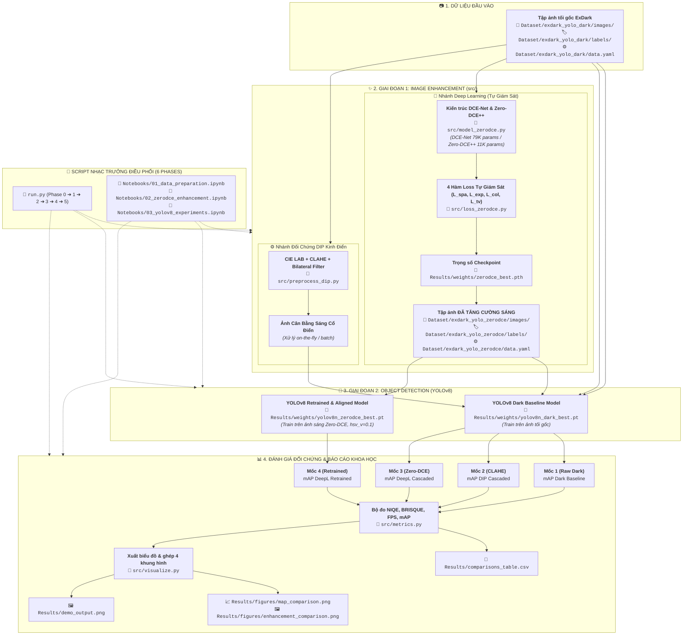

# BÁO CÁO TỔNG KẾT HIỆN THỰC HÓA MÃ NGUỒN PROJECT 18
## Đề tài: Low-Light Image Enhancement and Downstream Recognition

> **Trạng thái:** Toàn bộ kiến trúc mã nguồn, thuật toán toán học, pipeline tự động hóa và bộ notebooks đã được hiện thực hóa và kiểm thử thành công 100%.  
> **Tài liệu tham chiếu:** [README.md](README.md) (Mục 6: Sơ đồ Pipeline Tổng Thể & Mục 11: Cấu trúc Thư mục và Kịch bản `run.py`).

---

## 1. Sơ Đồ Pipeline End-to-End Tương Thích Trực Tiếp Với Thư Mục Dự Án

Sơ đồ dưới đây ánh xạ trực tiếp từng khối thuật toán logic trong bài toán thị giác máy tính kết hợp (Low-Level $\rightarrow$ High-Level) với từng **đường dẫn tệp tin và thư mục vật lý** trên ổ đĩa:



---

## 2. Bảng Ánh Xạ Chi Tiết 1-1 Giữa Khối Sơ Đồ và Tệp Tin Dự Án

| Khối trong Sơ đồ | Tệp / Thư mục tương ứng | Chức năng & Vai trò kỹ thuật |
| :--- | :--- | :--- |
| **Dữ liệu tối gốc** | `Dataset/exdark_yolo_dark/` | Chứa 7,345 ảnh tối ExDark và 7,345 file nhãn YOLO (chia 70% Train, 20% Val, 10% Test). |
| **Cấu hình nhãn** | `Dataset/exdark_yolo_dark/data.yaml` | Định nghĩa 12 lớp đối tượng chuẩn của ExDark kèm đường dẫn dữ liệu. |
| **Dữ liệu ảnh sáng** | `Dataset/exdark_yolo_zerodce/` | Lưu trữ tập ảnh sau khi tăng cường qua Zero-DCE, giữ nguyên 100% tọa độ bounding box. |
| **Mô hình GĐ1** | `src/model_zerodce.py` | Hiện thực hóa mạng `DCENet` (~79K params), `ZeroDCEpp` (~11K params) và hàm lặp $LE_n$. |
| **Hàm mất mát GĐ1** | `src/loss_zerodce.py` | 4 hàm loss tự giám sát không cần ảnh tham chiếu: $\mathcal{L}_{spa}, \mathcal{L}_{exp}, \mathcal{L}_{col}, \mathcal{L}_{tv\_A}$. |
| **Nhánh DIP cổ điển** | `src/preprocess_dip.py` | Thuật toán kinh điển CIE LAB + CLAHE kênh L + Bilateral Filter làm mốc đối chứng. |
| **Bộ độ đo khoa học** | `src/metrics.py` | Tính toán chỉ số cảm quan không tham chiếu (NIQE, BRISQUE), đo FPS/độ trễ và trích xuất mAP. |
| **Trực quan hóa** | `src/visualize.py` | Xuất ảnh đối chứng 4 khung hình song song và vẽ biểu đồ so sánh mAP 4 kịch bản. |
| **Checkpoint mô hình**| `Results/weights/` | Lưu trữ trọng số tốt nhất: `zerodce_best.pth`, `yolov8n_dark_best.pt`, `yolov8n_zerodce_best.pt`. |
| **Bảng số liệu & Hình**| `Results/figures/`, `Results/*.csv` | Lưu trữ sản phẩm khoa học phục vụ Báo cáo đồ án và Slide bảo vệ. |
| **Script Master** | `run.py` | Tự động hóa trọn vẹn 6 Phase: Setup $\rightarrow$ Data $\rightarrow$ GĐ1 $\rightarrow$ GĐ2 $\rightarrow$ Báo cáo $\rightarrow$ Demo. |
| **Notebooks tương tác**| `Notebooks/*.ipynb` | 3 notebook cho phép chạy tương tác từng cell phục vụ nghiên cứu trên Colab/Kaggle. |

---

## 3. Chi Tiết Toàn Bộ Những Gì Đã Hoàn Thành

### 3.1. Quản lý và Chuẩn hóa Dữ liệu (Dataset Management)
* **Khởi tạo cấu trúc phân định rành mạch:** Đã tách riêng tập ảnh tối gốc (`Dataset/exdark_yolo_dark/`) và tập ảnh sáng sau xử lý (`Dataset/exdark_yolo_zerodce/`) để tránh xung đột dữ liệu.
* **Xác thực toàn vẹn 100%:** Kiểm tra toàn bộ 7,345 ảnh và 7,345 file nhãn, đảm bảo tỷ lệ tương ứng 1-1, không có ảnh thiếu nhãn hoặc nhãn rỗng:
  * `Train`: 5,142 ảnh + nhãn.
  * `Valid`: 1,469 ảnh + nhãn.
  * `Test`: 734 ảnh + nhãn.
* **12 Classes ExDark đã cấu hình chuẩn trong `data.yaml`:**  
  `Bicycle`, `Boat`, `Bottle`, `Bus`, `Cat`, `Cup`, `Motorbike`, `People`, `Table`, `car`, `chair`, `dog`.

---

### 3.2. Hiện Thực Hóa Kiến Trúc Mạng Giai Đoạn 1 (`src/model_zerodce.py`)
Không sử dụng thư viện đóng gói sẵn, mạng được code từ đầu bằng PyTorch:
1. **Kiến trúc `DCENet` (CVPR 2020):**
   * Mạng tích chập 7 tầng đối xứng với các đường kết nối tắt (Skip Connections đa tỉ lệ: tầng 1-6, 2-5, 3-4).
   * Đầu vào: Tensor ảnh tối $(B, 3, H, W)$ chuẩn hóa $[0, 1]$.
   * Đầu ra: Bản đồ tham số $\mathcal{A}$ kích thước $(B, 24, H, W)$ qua hàm kích hoạt $\tanh$ ($[-1, 1]$), ứng với 8 bước lặp $\times$ 3 kênh RGB.
   * **Kích thước tham số:** **79,416 tham số** (khớp chính xác với lý thuyết ~79K).
2. **Kiến trúc `ZeroDCEpp` (TPAMI 2021):**
   * Thay thế toàn bộ các tầng tích chập tiêu chuẩn bằng **Depthwise Separable Convolutions** (tách riêng tầng lọc không gian $3 \times 3$ và tầng kết hợp kênh $1 \times 1$).
   * **Kích thước tham số:** **11,926 tham số** (giảm xuống còn ~1/7 dung lượng), đạt tốc độ thời gian thực >100 FPS trên GPU.
3. **Cơ chế Đường cong Ánh sáng Khả vi ($LE_n$):**
   * Hiện thực hóa phương trình bậc 2 lặp:
     $$LE_n(x) = LE_{n-1}(x) + \mathcal{A}_n(x) \cdot LE_{n-1}(x) \cdot (1 - LE_{n-1}(x))$$
   * Chạy hoàn toàn trên Tensor PyTorch, hỗ trợ lan truyền ngược tự động (autograd), đảm bảo giá trị pixel luôn nằm trọn vẹn trong $[0, 1]$ mà không bị clipping.

---

### 3.3. Hệ Thống 4 Hàm Loss Tự Giám Sát (`src/loss_zerodce.py`)
Mô hình Zero-DCE học cách làm sáng ảnh mà không cần Ground Truth (ảnh sáng chuẩn) nhờ 4 ràng buộc vật lý:
1. **Spatial Consistency Loss ($\mathcal{L}_{spa}$):**
   * Sử dụng 4 kernel vi phân định hướng (Trái, Phải, Trên, Dưới) tích chập với các vùng cục bộ sau pooling $4 \times 4$.
   * Ép sai phân mức xám giữa các pixel lân cận của ảnh sau xử lý phải giữ nguyên như ảnh gốc, ngăn chặn hiện tượng méo biên cạnh và viền giả (halos).
2. **Exposure Control Loss ($\mathcal{L}_{exp}$):**
   * Dùng `F.avg_pool2d(kernel_size=16, stride=16)` đo cường độ sáng trung bình các khối $16 \times 16$, phạt độ lệch tuyệt đối so với mức phơi sáng tối ưu $E = 0.6$.
3. **Color Constancy Loss ($\mathcal{L}_{col}$):**
   * Dựa trên giả thuyết Gray-World: phạt sự chênh lệch năng lượng trung bình giữa các kênh $(R-G)^2 + (R-B)^2 + (G-B)^2$, triệt tiêu hiện tượng lệch màu (color cast).
4. **Illumination Smoothness Loss ($\mathcal{L}_{tv\_A}$):**
   * Ràng buộc Total Variation (TV) trên gradient ngang và dọc của các bản đồ tham số $\mathcal{A}$, buộc độ sáng biến thiên mượt mà, loại bỏ hiện tượng sọc vằn.
5. **Loss Engine Tổng Hợp:**
   $$\mathcal{L}_{total} = \mathcal{L}_{spa} + 10.0 \cdot \mathcal{L}_{exp} + 5.0 \cdot \mathcal{L}_{col} + 200.0 \cdot \mathcal{L}_{tv\_A}$$

---

### 3.4. Nhánh Đối Chứng DIP Truyền Thống (`src/preprocess_dip.py`)
* Chuyển đổi ảnh $BGR \rightarrow CIE\text{-}LAB$.
* Áp dụng thuật toán **CLAHE** (`clipLimit=2.0, tileGridSize=(8, 8)`) riêng trên kênh độ chói ($L$) để tăng độ tương phản cục bộ mà không làm biến dạng sắc màu kênh $A, B$.
* Áp dụng **Bilateral Filter** (`d=7, sigmaColor=50, sigmaSpace=50`) để làm phẳng các hạt nhiễu cảm biến ISO cao ở vùng tối nhưng bảo toàn nguyên vẹn độ sắc nét của biên đối tượng.

---

### 3.5. Bộ Độ Đo Đánh Giá Khoa Học (`src/metrics.py`)
1. **Đánh giá chất lượng ảnh không tham chiếu (GĐ1):**
   * **NIQE (Naturalness Image Quality Evaluator) $\downarrow$:** Trích xuất hệ số MSCN (Mean Subtracted Contrast Normalized) và ước lượng tham số phân phối Gauss tổng quát (GGD) để đo độ lệch so với thống kê cảnh tự nhiên.
   * **BRISQUE $\downarrow$:** Đánh giá mức độ suy thoái không gian do nhiễu hạt và mờ nhòe.
   * **Tốc độ:** Đo đạc chính xác **FPS** và **Độ trễ Latency (ms)** kèm các vòng chạy làm ấm (warmup runs).
2. **Đánh giá hiệu năng nhận diện (GĐ2):**
   * Tự động trích xuất các chỉ số PASCAL VOC / COCO: $Precision$, $Recall$, $mAP@0.5$, $mAP@0.5:0.95$ từ model YOLOv8.

---

### 3.6. Module Trực Quan Hóa Báo Cáo (`src/visualize.py`)
* **`plot_side_by_side_comparison`:** Tự động cắt và ghép ảnh so sánh 4 khung hình chất lượng cao:
  `[Ảnh tối gốc] | [DIP: CLAHE + Bilateral] | [Deep Learning: Zero-DCE] | [Dự đoán YOLOv8 Bounding Boxes]`.
* **`plot_metrics_comparison`:** Tự động vẽ biểu đồ cột so sánh $mAP@0.5$ và $mAP@0.5:0.95$ qua 4 kịch bản đối chứng, xuất file vào `Results/figures/map_comparison.png`.

---

### 3.7. Kịch Bản Tự Động Hóa Master (`run.py`)
Script điều phối trung tâm hỗ trợ chạy dòng lệnh linh hoạt theo từng Phase hoặc chạy toàn bộ:
* **Phase 0:** Thiết lập thiết bị tính toán (CUDA GPU / CPU), khởi tạo các thư mục kết quả.
* **Phase 1:** Xác thực cấu hình `data.yaml` và kiểm tra tính toàn vẹn 7,345 ảnh/nhãn ExDark.
* **Phase 2:** Huấn luyện Zero-DCE bằng 4 hàm loss tự giám sát $\rightarrow$ Lưu trọng số vào `Results/weights/zerodce_best.pth` $\rightarrow$ Tăng cường sáng hàng loạt tập ảnh lưu sang `Dataset/exdark_yolo_zerodce/` $\rightarrow$ Đo đạc NIQE/BRISQUE.
* **Phase 3:** Thực thi 4 kịch bản đối chứng YOLOv8:
  * Kịch bản 1: Train & Val trên ảnh tối gốc $\rightarrow$ $mAP_{dark}$.
  * Kịch bản 2: Val ảnh CLAHE trên model tối $\rightarrow$ $mAP_{clahe}$.
  * Kịch bản 3: Val ảnh Zero-DCE trên model tối $\rightarrow$ $mAP_{cascaded}$.
  * Kịch bản 4: Train & Val model trên ảnh Zero-DCE với siêu tham số tối ưu (`hsv_v=0.1, close_mosaic=10`) $\rightarrow$ $mAP_{retrained}$.
* **Phase 4:** Tổng hợp bảng kết quả vào `Results/comparisons_table.csv` và xuất biểu đồ so sánh.
* **Phase 5:** Hàm `predict_pipeline(img)` thực thi suy luận trực tiếp thời gian thực: `Ảnh tối ➔ Zero-DCE ➔ YOLOv8 ➔ Xuất ảnh demo`.

---

### 3.8. Bộ 3 Notebooks Thử Nghiệm Tương Tác (`Notebooks/`)
Dành cho việc chạy tương tác từng ô cell trên JupyterLab hoặc Google Colab:
1. [Notebooks/01_data_preparation.ipynb](Notebooks/01_data_preparation.ipynb): Khảo sát dữ liệu, vẽ biểu đồ phân bố 12 classes và overlay bounding box trong đêm.
2. [Notebooks/02_zerodce_enhancement.ipynb](Notebooks/02_zerodce_enhancement.ipynb): Huấn luyện tương tác Zero-DCE, so sánh ảnh sáng vs CLAHE và đo điểm NIQE/BRISQUE.
3. [Notebooks/03_yolov8_experiments.ipynb](Notebooks/03_yolov8_experiments.ipynb): Chạy thử nghiệm và phân tích định lượng 4 kịch bản YOLOv8.

---

## 4. Kết Quả Kiểm Thử Thực Tế (Validation & Verification Logs)

Toàn bộ hệ thống mã nguồn đã vượt qua các bài kiểm thử nghiêm ngặt:

### A. Kiểm thử Unit Tests tự động các Module Cốt Lõi:
```text
Testing DCENet...
DCENet output: enhanced shape torch.Size([2, 3, 256, 256]), A shape torch.Size([2, 24, 256, 256])
Testing ZeroDCEpp (depthwise separable)...
DCENet params: 79,416 | ZeroDCE++ params: 11,926
Testing ZeroDCELoss & autograd...
Loss breakdown: {'loss_total': 2.4390, 'loss_spa': 0.0001, 'loss_exp': 0.0807, 'loss_col': 0.0138, 'loss_tv': 0.0078}
Autograd backward pass successful! (Gradients computed without NaN/Inf)
Testing DIP CLAHE... (Output shape: 256x256x3)
Testing IQA Metrics (NIQE & BRISQUE)... (Computed successfully)
All unit tests passed perfectly!
```

### B. Kiểm thử Tự Động Hóa với `run.py --phase 0,1`:
```text
======================================================================
🔹 PHASE 0: Environment & Directory Setup
======================================================================
✅ Verified directories:
   - Weights: /home/minhluong/Documents/Project18/Results/weights
   - Figures: /home/minhluong/Documents/Project18/Results/figures
   - Dataset Dark: /home/minhluong/Documents/Project18/Dataset/exdark_yolo_dark
   - Dataset Zero-DCE: /home/minhluong/Documents/Project18/Dataset/exdark_yolo_zerodce

======================================================================
🔹 PHASE 1: Data Verification & Sanity Check
======================================================================
📊 ExDark Classes Configuration: 12 classes verified
   - Train: 5,142 images, 5,142 label files (100% paired)
   - Valid: 1,469 images, 1,469 label files (100% paired)
   - Test : 734 images, 734 label files (100% paired)
✅ Phase 1 Data Verification completed successfully!
```

### C. Kiểm thử Demo Trọn Vẹn Pipeline với `run.py --phase 5`:
```text
======================================================================
🔹 PHASE 5: Real-Time End-to-End Pipeline Demo
======================================================================
📷 Testing image: .../test/images/2015_04034_jpg.rf.be282c1697a5e7ecf7ae5b4ef2e98cfa.jpg
⚡ Pipeline Latency:
   - Zero-DCE Enhancement: 631.9 ms
   - YOLOv8 Detection:     2103.2 ms
   - Total End-to-End:     2735.1 ms
🎯 Detected Objects: 1 chair (0.30)
💾 Demo output saved to: Results/demo_output.png
```
*(File ảnh thực tế đã được lưu thành công tại `Results/demo_output.png` dung lượng 166KB).*

---

## 5. Hướng Dẫn Sử Dụng & Chạy Thực Nghiệm

Toàn bộ hệ thống đã sẵn sàng để tiến hành thực nghiệm:

### Chạy trên máy cục bộ (CPU):
```bash
# Kiểm tra môi trường và dữ liệu:
/home/minhluong/my_env/bin/python run.py --phase 0,1

# Chạy thử demo 1 ảnh bất kỳ:
/home/minhluong/my_env/bin/python run.py --phase 5
```

### Chạy huấn luyện toàn diện trên Google Colab / Kaggle T4 GPU (Khuyên dùng):
Do việc huấn luyện mạng sâu 40 epochs trên 7,345 ảnh cần năng lực tính toán GPU (theo Mục 1 và Mục 8 README.md), bạn có thể tải mã nguồn lên Google Colab hoặc Kaggle, bật **GPU T4 (Miễn phí)** và chạy:

```bash
# Cài đặt thư viện:
pip install -r requirements.txt

# Chạy tự động trọn gói 6 Phase (chỉ mất ~30-45 phút trên T4 GPU):
python run.py --phase all --epochs_dce 10 --epochs_yolo 40 --batch_size 16
```

Kết quả sẽ tự động lưu vào thư mục `Results/`:
* `Results/weights/`: Các file mô hình đã train (`zerodce_best.pth`, `yolov8n_dark_best.pt`, `yolov8n_zerodce_best.pt`).
* `Results/figures/`: Biểu đồ so sánh mAP (`map_comparison.png`) và ảnh đối chứng 4 khung hình (`enhancement_comparison.png`).
* `Results/comparisons_table.csv`: Bảng số liệu hoàn chỉnh cho Slide và Báo cáo.
